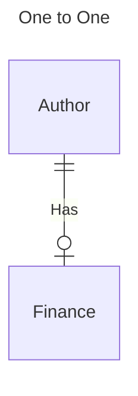
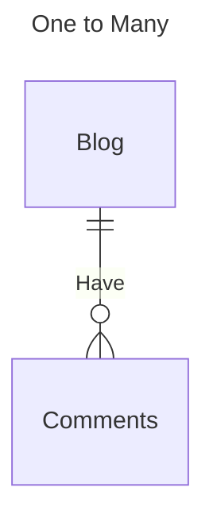
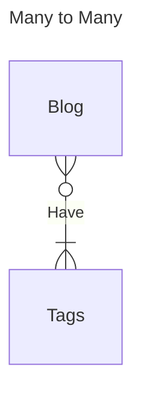
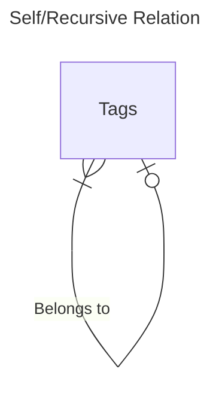
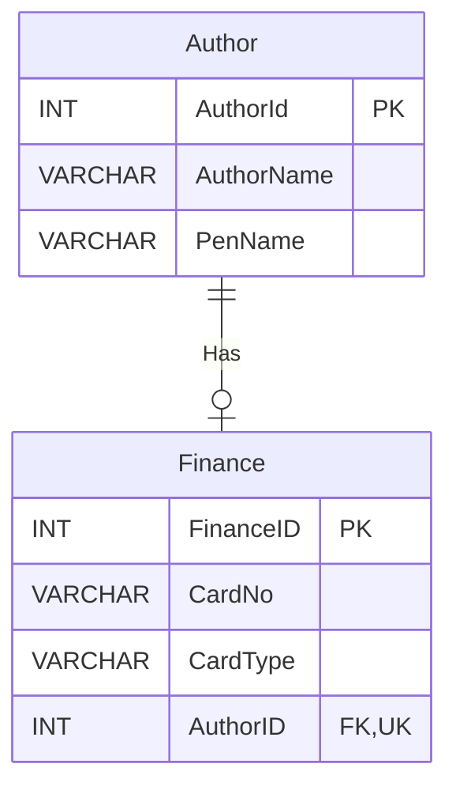
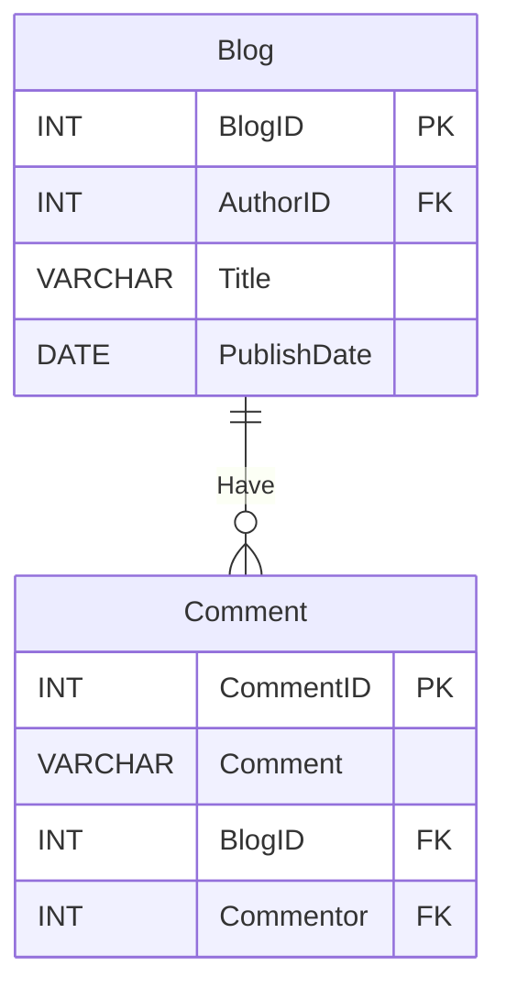
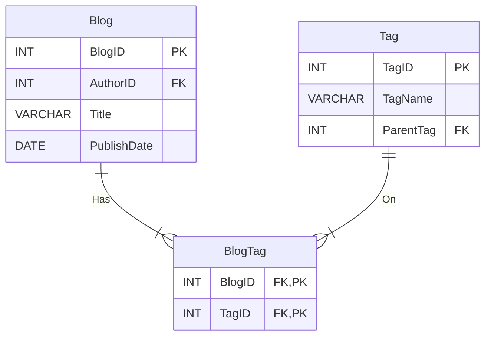
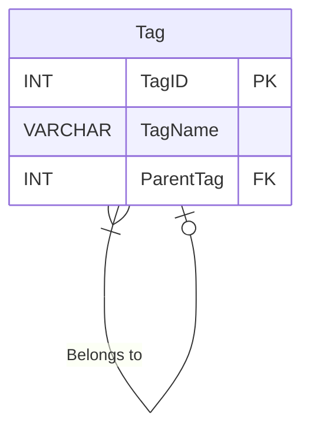
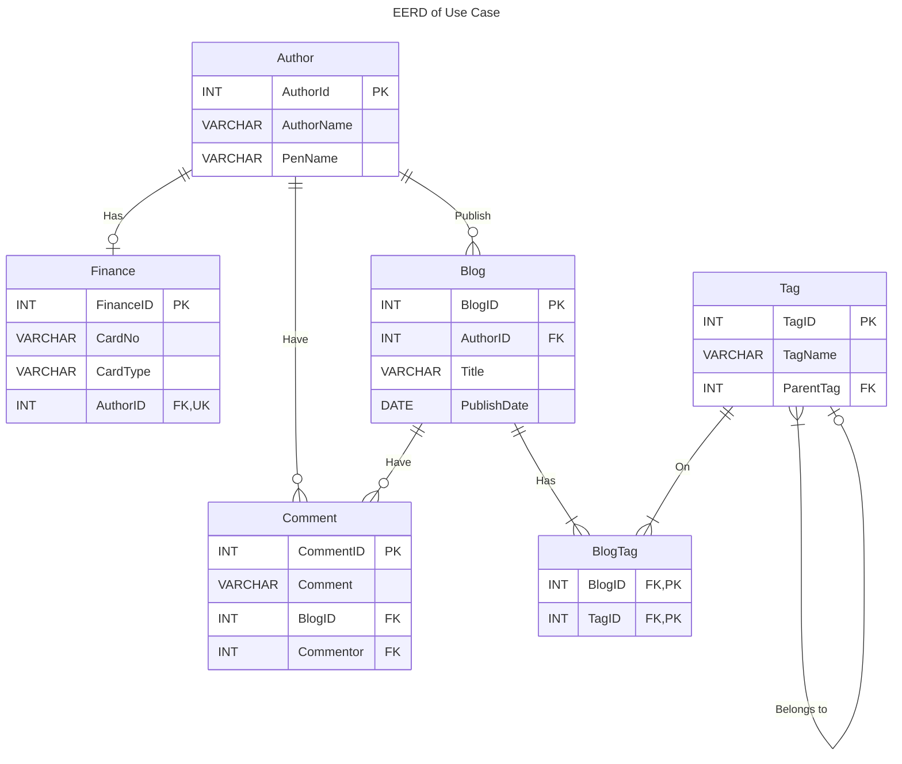

# Relationships of RDBMS

In this article, we will take a close detailed look at RDBMS relations with actual use case context and its application, including **One-to-one**, **One-to-many**, **Many-to-many** and **Self-referencing(Recursive) relations**.  
To build effective relationships one needs to know the type of relations, where, when & how to apply them, building effective relationships in a database is crucial because it promotes referential integrity enforcement, which in turn facilitates database standardization.  
For SQL query we will be using MySQL syntax and will stick to one SQL system for all the examples & code snippets.

## Flow

- What is RDBMS?
- How relationship is maintained
- Context of use case instance
- What is ER Diagram?
- Types of Relationship
  - One-to-One Relation
  - One-to-Many Relation
  - Many-to-Many Relation
  - self referencing
- Key takeaways
- Bonus
- Reach Out

## What is RDBMS?

- **RDBMS** stands for **Relational Database Management System**.
- **Relation** can exists between any **two entities** and in database term, **entities** are generally referred to **database tables**.
- It's **relational** as there may **exists** a type of **relation** between two **tables** from same database. Except there could be a Self-referencing(Recursive) relation within the table itself.

## How relationship is maintained

- Every table has a `PRIMARY KEY` which is a `UNIQUE` identifier of data/record in each table, with the help of this key we can identify and relate each `UNIQUE` record with another `UNIQUE` record.
- To create a relation between two tables namely Table A and Table B. We keep the reference of the `PRIMARY KEY` of Table A as a `FOREIGN KEY` in Table B or vice versa.
- When two table has a relation between them and Table B requires reference to Table A but not vice versa then Table A can be referred to as Parent Table and Table B as Child Table, i.e. Child Table has information which logically depends on the Parent table. The rule of thumb is to keep the `FOREIGN KEY` column in the Child Table and some business cases may demand it to be in the Parent Table.
- If the table has a `FOREIGN KEY` constraint then it has a relation with other data records/tables and the type of relation can be identified based on the constraints on `FOREIGN KEY`.
- When updating or deleting related records we need to ensure integrity is maintained for that purpose we can add additional constraints of `ON DELETE` & `ON UPDATE` to `FOREIGN KEY` with valid values of `RESTRICT`, `CASCADE`, `SET NULL`, `SET DEFAULT` or `NO ACTION`.

## Context of use case instance

You have been given a task to design a database schema for a blog site where the author can write blogs and publish them with the facility to add one or more appropriate tags. After a certain no. of engagement author can add their personal bank information to monetize their account which will be stored in a separate encrypted table. Other authors can add constructive comments to the desired blog. The site should have the facility to filter the blog based on the tags, if a sub-category is selected then fetch all blogs having matching sub-category tag and if a parent-category is selected then fetch all blogs with parent-category tag and its sub-category tag too.

- Crux points
  - Blog can be authored by a single author only.
  - Single author can publish multiple blogs.
  - Blog will have a minimum of one or more tags of category or sub-categories.
  - The author can add private finance information.
  - Blog can have comments from other users.
  - If a sub-category tag is added there is no need to enforce the parent category tag explicitly, but if the filter is applied to the parent category then all blog of the parent category & sub-category needs to be fetched.
  - Tag will have core categories and sub-categories.

## What is ER Diagram?

An **Entity-Relationship Diagram** (ERD) in RDBMS is a visual representation of a database's structure. It helps to design databases by illustrating what data is stored, its structure, and how entities are linked. It consists of:

1. **Entities**: Objects or concepts or tables in the database, like "Blog", "Author", "Tag" or "Finance".
2. **Attributes**: Properties of entities, such as "BlogID", "AuthorID", "AuthorName" or "TagName".
3. **Relationships**: Connections between entities, showing how they relate to each other, like "Author publishes the blog".
4. **Cardinality**: The number of instances of one entity that can be related to the number of instances of another entity., e.g., "1-1" for one-to-one or "1-M" for one-to-many relationships.

### ER Diagram Cardinality Notation


## Types of Relationship

There are 3 main types of relationship in RDBMS

- [One-to-One](#one-to-one-relation)
- [One-to-Many](#one-to-many-relation)
- [Many-to-Many](#many-to-many-relation)

<table>
<caption>Types of Relationship</caption>
<tr>
<td>



</td>
<td>



</td>
<td>



</td>
</tr>
<tr>
<td  colspan=3 style="text-align:center">



</td>
</tr>
</table>

- [Self/Recursive Relation](#self-referencingrecursive-relation): Is a special case where the record is referenced to another record from the same table with any one of the 3 relationship types.

### One-to-One Relation

A **one-to-one** relationship is a type of relationship between two tables where each record in one table can be associated with exactly one record in another table, and vice versa. This means that for every row/data record in the first table, there can be a corresponding and `UNIQUE` row in the second table, and vice versa.
For one-to-one relations, there can be unidirectional or bidirectional integrity of `FOREIGN KEY` constraints.

- If it's unidirectional and `FOREIGN KEY` is in the child table then the `FOREIGN KEY` column can have the constraint of `NOT NULL` which will ensure the parent record exists for the child record.
- If it's unidirectional and `FOREIGN KEY` is in the parent table then the `FOREIGN KEY` column cannot have constraint of `NOT NULL`. As the child is dependent on the parent and if parent record is not available then child record will not be available before the parent record.
- If it's bidirectional then none of the `FOREIGN KEY` columns will have `NOT NULL` constraint. It's similar to the paradox of "What came first? Chicken or Egg?
  > Take example for inserting data record in one-to-one setup where `1` is related to `a`,
  >
  > 1. Add record `1` in Table A
  > 2. Add record `a` in Table B
  > 3. Associate `a` from Table B in the record `1` of Table A

**In a one-to-one relation setting, `FOREIGN KEY` should have a `UNIQUE` constraint which ensures relationship integrity.**

#### Use Case

The author can add private information related to finance.

- Author can add their finance information to the system and there will be one-to-one relation mapping as authors are allowed to add only 1 finance information.
- The author's details will be in the Author table and its finance information will be in the Finance table. The author will be the parent table and Finance will be the child table.

##### Enhanced ER Diagram



##### Create Query

```sql
CREATE TABLE `blogs`.`author` (
  `AuthorID` INT AUTO_INCREMENT,
  `AuthorName` VARCHAR(255) NOT NULL,
  `PenName` VARCHAR(45) NOT NULL,
  PRIMARY KEY (`AuthorID`));
```

```sql
CREATE TABLE `blogs`.`finance` (
  `FinanceID` INT NOT NULL AUTO_INCREMENT,
  `CardNo` VARCHAR(16) NOT NULL,
  `CardType` VARCHAR(45) NOT NULL,
  `AuthorID` INT `UNIQUE` NOT NULL,
  PRIMARY KEY (`FinanceID`),
	`FOREIGN KEY` (`AuthorID`)
    REFERENCES `blogs`.`author` (`AuthorID`)
    ON DELETE NO ACTION
    ON UPDATE NO ACTION);
```

##### Insert Query

```sql
INSERT INTO `blogs`.`author` (`AuthorName`, `PenName`) VALUES ('John Doe', 'blogger');
INSERT INTO `blogs`.`author` (`AuthorName`, `PenName`) VALUES ('Jane Doe', 'techie');
INSERT INTO `blogs`.`finance` ( `CardNo`, `CardType`, `AuthorID`) VALUES ('123', 'visa', '2');
INSERT INTO `blogs`.`finance` ( `CardNo`, `CardType`, `AuthorID`) VALUES ('789', 'visa prem', '1');
```

##### Fetch Query

```sql
SELECT * FROM blogs.author;
```

|     | AuthorID | AuthorName | PenName |
| --: | -------: | :--------- | :------ |
|   0 |        1 | John Doe   | blogger |
|   1 |        2 | Jane Doe   | techie  |

```sql
SELECT * FROM blogs.finance;
```

|     | FinanceID | CardNo | CardType  | AuthorID |
| --: | --------: | -----: | :-------- | -------: |
|   0 |         1 |    123 | visa      |        2 |
|   1 |         2 |    789 | visa prem |        1 |

```sql
SELECT * FROM blogs.author JOIN blogs.finance USING(AuthorID);
-- SELECT * FROM blogs.author JOIN blogs.finance ON author.AuthorId=finance.AuthorId;
```

|     | AuthorID | AuthorName | PenName | FinanceID | CardNo | CardType  |
| --: | -------: | :--------- | :------ | --------: | -----: | :-------- |
|   0 |        1 | John Doe   | blogger |         2 |    789 | visa prem |
|   1 |        2 | Jane Doe   | techie  |         1 |    123 | visa      |

### One-to-Many Relation

A **one-to-many** relationship is the most commonly used relationship among tables. In this type of relationship, data records from the parent table can be linked to zero or more data records in the child table. However, one record from child table cannot be linked to more than one record in the parent table. For one-to-many relations, there can be only a unidirectional `FOREIGN KEY` constraint in the child table.

**In a one-to-many relation setting, `FOREIGN KEY` will not have a `UNIQUE` constraint which allows for many(duplicate) references.**

#### Use Case

There are multiple instances in our use case for one-to-many such as a single author can publish multiple blogs, a blog can have multiple comments, we can have a core tag table and sub-tag table which can hold mapping of core & sub-category tag, etc.
For reference let's select an instance of a blog that can have multiple comments, where the blog will be stored in the blog table and comments will be stored in the comment table.

##### Enhanced ER Diagram



##### Create Query

```sql
CREATE TABLE `blogs`.`blog` (
  `BlogID` INT NOT NULL AUTO_INCREMENT,
  `AuthorID` INT NOT NULL,
  `Title` VARCHAR(100) NOT NULL,
  `PublishDate` DATE NOT NULL,
  PRIMARY KEY (`BlogID`),
    `FOREIGN KEY` (`AuthorID`)
    REFERENCES `blogs`.`author` (`AuthorID`)
    ON DELETE RESTRICT
    ON UPDATE RESTRICT);
```

```sql
CREATE TABLE `blogs`.`comment` (
  `CommentID` INT NOT NULL AUTO_INCREMENT,
  `Comment` VARCHAR(255) NOT NULL,
  `BlogID` INT NOT NULL,
  `Commentor` INT NULL,
  PRIMARY KEY (`CommentID`),
    `FOREIGN KEY` (`Commentor`)
    REFERENCES `blogs`.`author` (`AuthorID`)
    ON DELETE SET NULL
    ON UPDATE SET NULL,
    `FOREIGN KEY` (`BlogID`)
    REFERENCES `blogs`.`blog` (`BlogID`)
    ON DELETE CASCADE
    ON UPDATE CASCADE);
```

##### Insert Query

```sql
INSERT INTO `blogs`.`blog` (`AuthorID`, `Title`, `PublishDate`) VALUES ('1', 'John''s Adventure', '2023-09-10');
INSERT INTO `blogs`.`blog` (`AuthorID`, `Title`, `PublishDate`) VALUES ('1', 'Anonymous John Doe', '2023-10-07');
INSERT INTO `blogs`.`blog` (`AuthorID`, `Title`, `PublishDate`) VALUES ('2', 'Uncommon Jane Doe', '2023-10-20');
INSERT INTO `blogs`.`blog` (`AuthorID`, `Title`, `PublishDate`) VALUES ('1', 'RDBMS''s Relationship', '2023-10-31');
INSERT INTO `blogs`.`comment` (`Comment`, `BlogID`, `Commentor`) VALUES ('Nice Adventure', '1', '2');
INSERT INTO `blogs`.`comment` (`Comment`, `BlogID`, `Commentor`) VALUES ('Yeah Thanks', '1', '1');
INSERT INTO `blogs`.`comment` (`Comment`, `BlogID`, `Commentor`) VALUES ('May I know the place?', '1', '2');
INSERT INTO `blogs`.`comment` (`Comment`, `BlogID`, `Commentor`) VALUES ('I think it''s gonna be good', '4', '2');
INSERT INTO `blogs`.`comment` (`Comment`, `BlogID`, `Commentor`) VALUES ('Wish me the Best', '4', '1');
```

##### Fetch Query

```sql
SELECT * FROM blogs.blog;
```

|     | BlogID | AuthorID | Title                | PublishDate |
| --: | -----: | -------: | :------------------- | :---------- |
|   0 |      1 |        1 | John's Adventure     | 2023-09-10  |
|   1 |      2 |        1 | Anonymous John Doe   | 2023-10-07  |
|   2 |      3 |        2 | Uncommon Jane Doe    | 2023-10-20  |
|   3 |      4 |        1 | RDBMS's Relationship | 2023-10-31  |

```sql
SELECT * FROM blogs.comment;
```

|     | CommentID | Comment               | BlogID | Commentor |
| --: | --------: | :-------------------- | -----: | --------: |
|   0 |         1 | Nice Adventure        |      1 |         2 |
|   1 |         2 | Yeah Thanks           |      1 |         1 |
|   2 |         3 | May I know the place? |      1 |         2 |

```sql
SELECT * FROM blogs.blog LEFT JOIN blogs.comment USING(BlogID);
```

|     | BlogID | AuthorID | Title                | PublishDate | CommentID | Comment                    | Commentor |
| --: | -----: | -------: | :------------------- | :---------- | --------: | :------------------------- | --------: |
|   0 |      1 |        1 | John's Adventure     | 2023-09-10  |         1 | Nice Adventure             |         2 |
|   1 |      1 |        1 | John's Adventure     | 2023-09-10  |         2 | Yeah Thanks                |         1 |
|   2 |      1 |        1 | John's Adventure     | 2023-09-10  |         3 | May I know the place?      |         2 |
|   3 |      2 |        1 | Anonymous John Doe   | 2023-10-07  |      NULL | NULL                       |      NULL |
|   4 |      3 |        2 | Uncommon Jane Doe    | 2023-10-20  |      NULL | NULL                       |      NULL |
|   5 |      4 |        1 | RDBMS's Relationship | 2023-10-31  |         4 | I think it's gonna be good |         2 |
|   6 |      4 |        1 | RDBMS's Relationship | 2023-10-31  |         5 | Wish me the Best           |         1 |

### Many-to-Many Relation

**Many-to-many** is a relation where a record from one table can be associated with many rows from another table and vice versa, i.e. parent records can have multiple child records & child records can have multiple parent records.
This type of relationship can be created using a third table called the “Junction table” or “Bridging table” which will hold the mapping of both tables.

**In many-to-many relations, none of the two tables will hold `FOREIGN KEY`. `FOREIGN KEY` will be residing in Junction/Bridging Table which will have a Composite Primary Key consisting of `FOREIGN KEY`s referencing Parent and child records.**

#### Use Case

A blog can have one or more tags and multiple blogs can fall under the same category or sub-category.

##### Enhanced ER Diagram



##### Create Query

> Blog table created in One-to-many relations.  
> Tag table created in Recursive relations.

```sql
CREATE TABLE `blogs`.`blogtag` (
  `BlogID` INT  NOT NULL,
  `TagID` INT  NOT NULL,
  PRIMARY KEY (`BlogID`, `TagID`),
    `FOREIGN KEY` (`BlogID`)
    REFERENCES `blogs`.`blog` (`BlogID`)
    ON DELETE CASCADE
    ON UPDATE CASCADE,
    `FOREIGN KEY` (`TagID`)
    REFERENCES `blogs`.`tag` (`TagID`)
    ON DELETE RESTRICT
    ON UPDATE RESTRICT);
```

##### Insert Query

> Blog table populated in One-to-many relations.  
> Tag table populated in Recursive relations.

```sql
INSERT INTO `blogs`.`blogtag` (`BlogID`, `TagID`) VALUES ('1', '2');
INSERT INTO `blogs`.`blogtag` (`BlogID`, `TagID`) VALUES ('1', '6');
INSERT INTO `blogs`.`blogtag` (`BlogID`, `TagID`) VALUES ('2', '5');
INSERT INTO `blogs`.`blogtag` (`BlogID`, `TagID`) VALUES ('3', '5');
INSERT INTO `blogs`.`blogtag` (`BlogID`, `TagID`) VALUES ('4', '4');
```

##### Fetch Query

> Blog table record in One-to-many relations.  
> Tag table record in Recursive relations.

```sql
SELECT * FROM blogs.blogtag;
```

|     | BlogID | TagID |
| --: | -----: | ----: |
|   0 |      1 |     2 |
|   1 |      4 |     4 |
|   2 |      2 |     5 |
|   3 |      3 |     5 |
|   4 |      1 |     6 |

```sql
SELECT * FROM blogs.blog JOIN blogs.blogtag USING(BlogID) JOIN blogs.tag USING(TagID);
```

|     | TagID | BlogID | AuthorID | Title                | PublishDate | TagName   | ParentTag |
| --: | ----: | -----: | -------: | :------------------- | :---------- | :-------- | --------: |
|   0 |     2 |      1 |        1 | John's Adventure     | 2023-09-10  | Mountains |         1 |
|   1 |     6 |      1 |        1 | John's Adventure     | 2023-09-10  | Adventure |      NULL |
|   2 |     5 |      2 |        1 | Anonymous John Doe   | 2023-10-07  | Biography |      NULL |
|   3 |     5 |      3 |        2 | Uncommon Jane Doe    | 2023-10-20  | Biography |      NULL |
|   4 |     4 |      4 |        1 | RDBMS's Relationship | 2023-10-31  | RDBMS     |         3 |

### Self-referencing/Recursive Relation

A **self-referencing/recursive** relationship in a database occurs when a column in a table relates to another column in the same table i.e. parent and child table are the same which means that the table contains a `FOREIGN KEY` column that references its `PRIMARY KEY`(`UNIQUE`) column. Recursive relations can exhibit any of the one-to-one, one-to-many or many-to-many relations. This type of relationship is often used to model hierarchical or recursive data structures where each row in the table has a parent or ancestor within the same table.

**In self-referencing relation, the `FOREIGN KEY` column will hold a reference to the `PRIMARY KEY`(`UNIQUE`) column of the same table.**

#### Use Case

The core tag can have many sub-categories which can be modeled as one-to-many relations with the help of two tables or in a single table with recursive relations exhibiting one-to-many relations. The decision of self-referencing table completely depends on one's personal choice.

##### Enhanced ER Diagram



##### Create Query

```sql
CREATE TABLE `blogs`.`tag` (
  `TagID` INT NOT NULL AUTO_INCREMENT,
  `TagName` VARCHAR(45) NOT NULL,
  `ParentTag` INT NULL,
  PRIMARY KEY (`TagID`));

ALTER TABLE `blogs`.`tag`
ADD CONSTRAINT `ParentTag`
  `FOREIGN KEY` (`ParentTag`)
  REFERENCES `blogs`.`tag` (`TagID`)
  ON DELETE SET NULL
  ON UPDATE SET NULL;
```

##### Insert Query

```sql
INSERT INTO `blogs`.`tag` (`TagName`) VALUES ('Region');
INSERT INTO `blogs`.`tag` (`TagName`, `ParentTag`) VALUES ('Mountains', '1');
INSERT INTO `blogs`.`tag` (`TagName`) VALUES ('Tech');
INSERT INTO `blogs`.`tag` (`TagName`, `ParentTag`) VALUES ('RDBMS', '3');
INSERT INTO `blogs`.`tag` (`TagName`) VALUES ('Biography');
INSERT INTO `blogs`.`tag` (`TagName`) VALUES ('Adventure');
```

##### Fetch Query

```sql
SELECT t1.TagID, t1.TagName, t2.TagName AS ParentTag FROM blogs.tag t1 LEFT JOIN blogs.tag t2 ON t1.ParentTag=t2.TagID;
```

|     | TagID | TagName   | ParentTag |
| --: | ----: | :-------- | :-------- |
|   0 |     1 | Region    | NULL      |
|   1 |     2 | Mountains | Region    |
|   2 |     3 | Tech      | NULL      |
|   3 |     4 | RDBMS     | Tech      |
|   4 |     5 | Biography | NULL      |
|   5 |     6 | Adventure | NULL      |

## Key takeaways

- RDBMS has 3 main types of relations namely **one-to-one**, **one-to-many** and **many-to-many**.
- **One-to-one** has a `UNIQUE` constraint on the `FOREIGN KEY` column, it can be a unidirectional or bidirectional relation.
- **One-to-many** does not have a `UNIQUE` constraint on the `FOREIGN KEY` column, it will be unidirectional and the `FOREIGN KEY` column will be in the child table.
- **Many-to-many** requires a Junction/Bridging table to maintain a relationship that has composite primary keys consisting of `FOREIGN KEY`s referencing Parent and child records.
- **Recursive relation** is mainly used to maintain hierarchy relation and it contains a `FOREIGN KEY` column that references its `PRIMARY KEY`(`UNIQUE`) column and it can exhibit any one type of relationship.

## Bonus

### Complete EERD



### Recursive Fetching

Recursive CTE will fetch all the records from the hierarchy in top-to-bottom or bottom-to-top approach.

#### Bottom-to-Top

```sql
WITH RECURSIVE cte (TagID, TagName, ParentTag) AS (
  SELECT t1.* FROM tag t1 WHERE t1.TagID=2
  UNION ALL
  SELECT t2.* FROM tag t2 INNER JOIN cte ON t2.TagID = cte.ParentTag
)
SELECT * FROM cte;
```

|     | TagID | TagName   | ParentTag |
| --: | ----: | :-------- | --------: |
|   0 |     2 | Mountains |         1 |
|   1 |     1 | Region    |      NULL |

#### Top-to-Bottom

```sql
WITH RECURSIVE cte (TagID, TagName, ParentTag) AS (
  SELECT t1.* FROM tag t1 WHERE t1.TagID=1
  UNION ALL
  SELECT t2.* FROM tag t2 INNER JOIN cte ON t2.parentTag = cte.TagID
)
SELECT * FROM cte;
```

|     | TagID | TagName   | ParentTag |
| --: | ----: | :-------- | --------: |
|   0 |     1 | Region    |      NULL |
|   1 |     2 | Mountains |         1 |

### Object Relationship Mapper (ORM)

- **Object-relational mapping** (ORM) is a programming technique that uses **object-oriented programming** (OOP) features in the relational database management system (RDBMS) world.
- It often provides a level of database independence i.e. user can learn an ORM framework that can be implemented on various databases which takes the hassle of remembering different keywords for the same logic in several SQL Systems. ORM frameworks protect against SQL injection attacks by handling parameterized queries & input sanitization automatically.
- It comes with its own set of disadvantages as it adds to performance overhead, requires learning of programming language & ORM framework, can introduce complexity and hurdled the optimization and database-specific features that may not be available in ORM.
- ORMs Framework for programming language: SQLAlchemy(`Python`), Sequelize(`NodeJs`), Hibernate(`Java`), ActiveRecord(`Ruby`), etc.

## Reach Out

For more intuitive blogs follow me on Medium & Github. You can also reach out to me via LinkedIn or X(Twitter).

[][reach_linkedin]
[][reach_x]
[][reach_github]
[][reach_medium]

[reach_linkedin]: https://www.linkedin.com/in/godwin1100
[reach_x]: https://twitter.com/l_shivam_l
[reach_medium]: https://medium.com/@godwin1100
[reach_github]: https://github.com/GodWin1100
