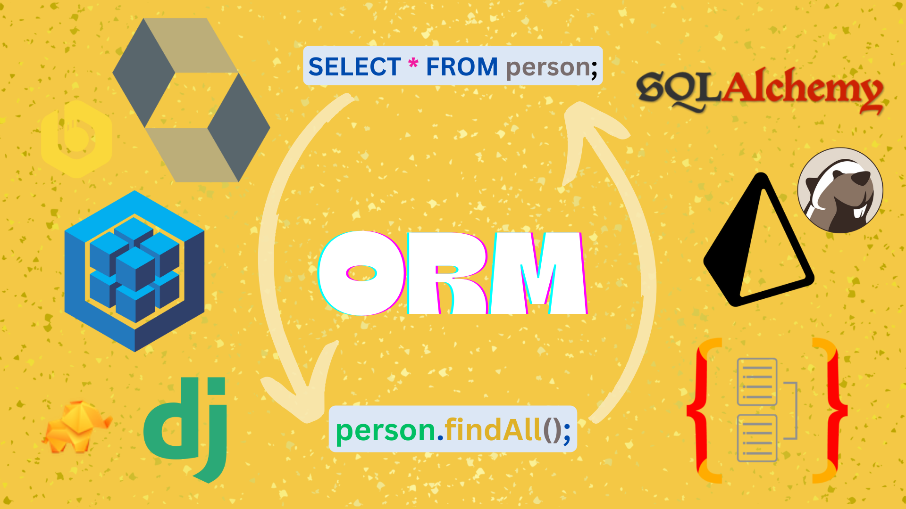
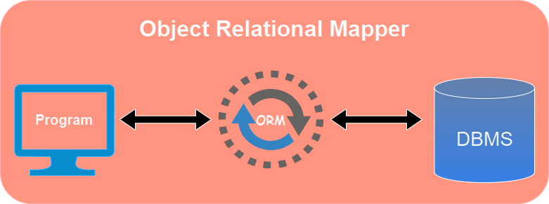
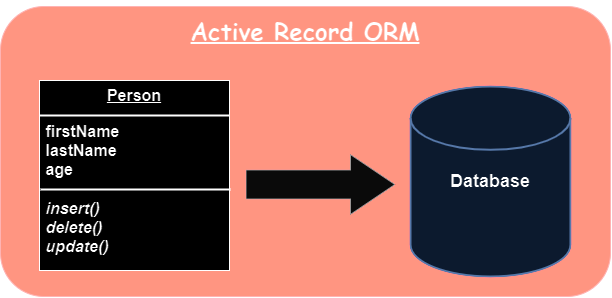
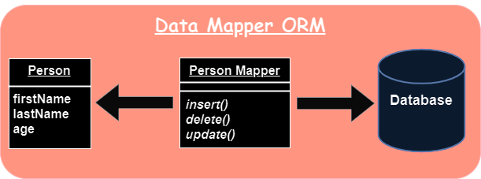
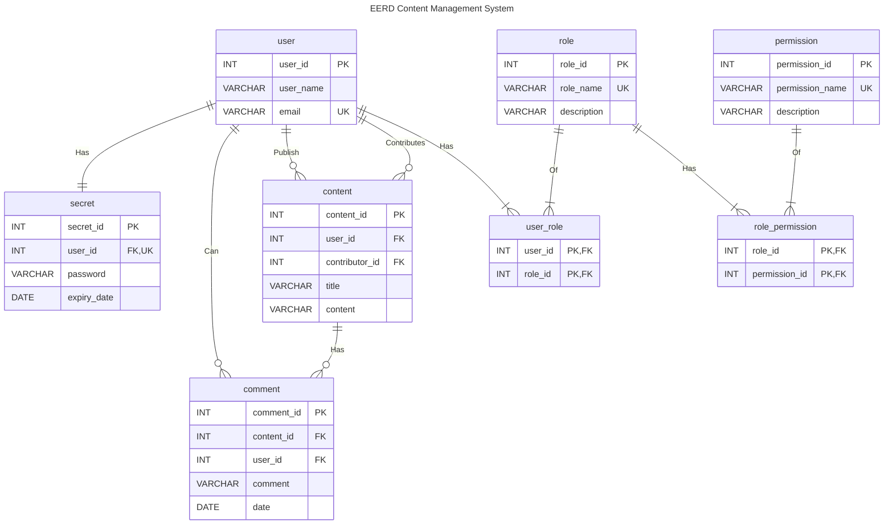

# ORM: Bridging Code and DBMS



If you are new to programming backed by databases, you may have come across the term **ORM** during your research. This blog aims to unravel the complexities of ORM, compare it to traditional SQL queries, shed light on its internal workings, and showcase a practical implementation of use cases with ORMs in NodeJs, Python, and Java.

Whether you're a seasoned developer or just starting your journey, understanding ORM can greatly enhance your ability to work with databases and streamline your projects.

By the end of this blog, you'll have a solid understanding of ORM and how it works. You'll also have the tools to explore ORM in Nodejs, Python, and Java, making this blog a valuable resource for developers at all levels of expertise. So, let's embark on this ORM journey together and unlock the power of efficient data management in your projects.

For curious learners of **SQL**, **Nodejs** and **Python**, resources are available on the GitHub page, which includes implementations in **Sequelize**(NodeJs) and **SQLAlchemy**(Python).

## Flow

1. [Read on Medium?](https://godwin1100.medium.com/orm-bridging-code-and-dbms-b61dbb0ce798)
2. [What is ORM?](#what-is-orm)
3. [ORM Mechanics](#orm-mechanics)
4. [Patterns of ORM](#patterns-of-orm)
   1. [Active Record](#active-record)
   2. [Data Mapper](#data-mapper)
5. [Context of Use Case Instance](#context-of-use-case-instance)
6. [Pros of ORM](#pros-of-orm)
7. [Cons of ORM](#cons-of-orm)
8. [Key Takeaways](#key-takeaways)
9. [Bonus](#bonus)
10. [Reach Out](#reach-out)

## What is ORM?

An **ORM**, or **Object Relational Mapper**, is a part of software designed to align and translate the data representations used by databases and those used in object-oriented programming. The ORM provides an object-oriented interface to data records within the database; this creates, in effect, a "_virtual object database_" which could be used from within the programming language.



In general, ORMs serve as an **abstraction layer** between the database and the program, enabling programmers to read, write, and manipulate objects without having to consider how those objects relate to their data sources and without drastically changing the object-oriented paradigm. Programmers can seamlessly execute a range of data-related tasks, including creating, reading, updating, and deleting (CRUD) operations in a database system without the cognitive burden of dealing with SQL queries tailored to the database.

## ORM Mechanics

The **Engine** and **Dialect** are two crucial parts that are required for the operation of the Object-Relational Mapping (ORM) architecture. The Engine manages the database connections and transaction handling, requiring configuration details such as the connection string. The Dialect translates high-level, database-agnostic queries generated by the ORM into database-specific SQL statements.

In addition to these, you need to define object-to-database mappings, which involve specifying how your application's objects correspond to the database tables. Querying is simplified using the ORM's high-level querying capabilities; transaction management ensures data consistency; and data type conversion handles the conversion between programming language data types and database data types. Performance-enhancing capabilities like caching, faster query execution, and schema creation and migration may also be included in ORM frameworks.

## Patterns of ORM

Several different patterns can be used to implement Object-Relational Mapping (ORM):

- **Active Record**: The Active Record pattern is a simple and easy-to-use ORM pattern where each database record is represented by a corresponding object in the application.
- **Data Mapper**: The Data Mapper pattern separates the application’s data model from the database, and provides a way to map the data stored in the database to objects in the application and vice versa.
- **Table Data Gateway**: The Table Data Gateway pattern is a simple and efficient ORM pattern that maps a single database table to a corresponding class in the application.
- **Unit of Work**: The Unit of Work pattern keeps track of all the changes that have been made to the objects in the application, and ensures that the database is updated accordingly when the transaction is committed.

The most popular patterns in the ORM and at the corporate level are **Active Record** and **Data Mapper**. We'll be exploring these patterns in great detail.

### Active Record

The **Active Record** pattern is one of the most widely used ORM patterns, especially for small to mid-size web backends. It maps a database record to a corresponding object in the application, and each database record is represented by an instance of an Active Record class. The class provides methods for performing database operations such as insertion, retrieval, update, and deletion. As a result, it allows the object to manage its persistence and retrieval, eliminating the need for a separate data access layer.



The fundamental idea behind the active record pattern is that your database records are "_active_" in your system, much like the OOPs paradigm, where the database table or view is wrapped into a class and each object instance is bound to a specific row in the table. In the Active Record pattern, every operation is auto-committed, and for the transactional operation, we need to create a session or context as provided by the framework.

For instance, in the Active Record pattern, the class might have a `save` method that inserts or updates the database record, a `find` method that retrieves a record from the database, and a `delete` method that removes the record from the database.

```js
data_obj = new TableClass({ firstName: "John", lastName: "Doe", age: 25 });

// to save
data_obj.save();

// to update
data_obj.age = 30;
data_obj.save();

// to find
data_obj2 = TableClass.findOne();

// to delete
data_obj.destroy(); // delete() or remove()
```

**Pros:**

- Simple and maintainable.
- Easy to understand and beginner-friendly

**Cons:**

- Active Record is tightly coupled with Database
- Lack of flexibility
- Hard to write test cases
- Performance Bottlenecks

### Data Mapper

A **Data Mapper** is a Data Access Layer that performs bidirectional transfers of data between a _persistent data store(database)_ and an _in-memory data representation(object)_. The Data Mapper pattern provides a clear separation between the application’s data model and the database. Each data mapper class/repository is responsible for mapping a specific type of object, and it knows how to convert the data stored in the database into objects and vice versa.



The benefit of the Data Mapper pattern is that data objects do not need to know anything about how data is stored in the database. This means that the objects will be lighter because they don’t have to inherit ORM methods, but there will be a stricter process for interacting with the database because you can’t just call the object method anywhere in your code.

The biggest difference between the data mapper pattern and the active record pattern is that the data mapper is meant to be a layer between the actual business logic of the application and the database that persists its data, whereas the active record seeks to invisibly bridge the gaps between the two as seamlessly as possible, the role of the data mapper is to allow you to consider the two more independently.

For example, if you have a `User` class in your application, you would have a `userMapper` class or `userRepository` that would be responsible for loading and saving `User` objects from and to the database. The `userMapper` class or `userRepository` would have methods such as `findById` and `save` that would handle the retrieval and persistence of `User` objects, respectively.

```js
const userRepository = MyDataSource.getRepository(User);

const user = new User();
user.firstName = "John";
user.lastName = "Doe";
user.age = 25;

// to save
userRepository.save(user);

// to find
const allUsers = userRepository.find();

// to update
userRepository.update(1, { age: 30 });

const john = userRepository.findOneBy({
  id: 1,
}); // find by id
// to delete
userRepository.remove(john);
```

**Pros:**

- Distinct separation of application and database
- Greater flexibility and maintainability
- Much more performant

**Cons:**

- Increased complexity
- Intimidating to understand
- Lack of control

## Context of Use Case Instance

In this scenario, you are given the responsibility to design a database schema for a **Content Management System (CMS)** that will allow users to create, manage, and interact with various types of content. The schema will include tables for user management, content, role-based access control, and user-generated comments. _(For simplicity not considering workspace/team, tag table, and accurate temporal attributes)._ Below is an overview of the tables and their respective columns:

### Enhanced ER Diagram



### Use Case Code

- **[SQL Raw Queries](./Raw_SQL_Query.md)**
  - Raw SQL Queries related to complete use case.
  - Contains Queries & Output
- **[Sequelize: NodeJs ORM](./NodeJs_Sequelize.md)**
  - Sequelize ORM code for same Raw SQL Queries and some extras.
  - Contains Code & Output.
  - Output also contains background SQL queries fired by each ORM function.
- **[SQLAlchemy: Python ORM](./Python_SQLAlchemy.ipynb)**
  - Python ORM code for same Raw SQL Queries and some extras.
  - Contains Code & Output.
  - Output also contains background SQL queries fired by each ORM function.
- **Hibernate: Java ORM**
  - Will be added soon

## Pros of ORM

- **Object-Oriented Approach:** ORM aligns with modern software development practices, which promotes quicker development with less boilerplate SQL code. It easily integrates with Model-View-Controller design patterns.
- **Database Interaction:** ORM simplifies database operations, making code more readable and maintainable and making it easy to switch between different database systems with minimal code changes.
- **Abstraction of Complex SQL:** ORM abstracts SQL complexities, making it accessible to developers.
- **Security and Maintainability:** Provides security against database interactions by employing parameterized queries, protection against SQL injections, automatic data sanitization, and consistent security practices.

## Cons of ORM

- **Performance Overhead:** ORM can lead to slower database interactions due to generated queries not being fully optimized for the database system.
- **Learning Curve:** Requires time to learn the ORM framework and its concepts.
- **Limited Control:** Limits fine-tuning and optimization of database interactions.
- **Complexity in Mapping:** Handling complex database structures or non-standard schemas can be cumbersome, which leads to poor mapping and performance.
- **Maintainability:** ORM may struggle to reconcile the differences between objects and databases, especially in complex databases, and as the application evolves, mapping needs to be maintained and in sync with the database.

## Key Takeaways

The use of ORMs can significantly simplify database operations by offering beneficial abstractions. They can assist you in rapid development and iteration while bridging the conceptual gaps between database structures and application logic. It employs out-of-the-box database security practices for communication between the program and the database. However, many of these advantages act as a double-edged sword. ORM can prevent you from the underlying understanding of your databases, make it challenging to debug, or increase performance overhead.

## Bonus

### ORMs

- Node.js
  - [Sequelize](https://sequelize.org/) _(Active Record)_
  - [TypeORM](https://typeorm.io/) _(Data Mapper and Active Record)_
  - [Prisma](https://www.prisma.io/) _(Data Mapper)_
  - [Mongoose](https://mongoosejs.com/) _(NoSQL, Active Record)_
- Java
  - [Hibernate](https://hibernate.org/orm/) _(Data Mapper)_
- Python
  - [SQLAlchemy](https://www.sqlalchemy.org/) _(Data Mapper)_
  - [Django's ORM](https://docs.djangoproject.com/en/4.2/topics/db/) _(Active Record)_

### Relationship in RDBMS

To learn more about relationships in RDBMS you can go and read my blog [Relationships of RDBMS](../01-Relationships_of_RDBMS/) which includes ER Diagram, ER Diagram notation, DDL command for each relation, and practical implementation of Blog Site Database.

### Database Tools

Want to connect with several databases using a database management tool? Comparable to **ORM** for linking different databases, but with visual interaction? [**DBeaver**](https://dbeaver.io/) is the get-go. It is a cross-platform, free, open-source, ever-evolving database tool that anyone working with databases can use. It supports all popular SQL databases and provides a data editor, SQL editor, and database maintenance tools. It also offers a commercial version that can be considered an enhanced, robust edition of the open-source variant.  
More tools similar to **DBeaver** are [DataGrip](https://www.jetbrains.com/datagrip/) by JetBrains, [TablePlus](https://tableplus.com/), [dbvis](https://www.dbvis.com/) and minimalistic yet notable [Beekeeper Studio](https://www.beekeeperstudio.io/).

## Reach Out

For more intuitive blogs follow me on Medium & Github. You can also reach out to me via LinkedIn or X(Twitter).

[][reach_linkedin]
[][reach_x]
[][reach_github]
[][reach_medium]

[reach_linkedin]: https://www.linkedin.com/in/godwin1100
[reach_x]: https://twitter.com/l_shivam_l
[reach_medium]: https://medium.com/@godwin1100
[reach_github]: https://github.com/GodWin1100
