# Git: Mastering the Essentials

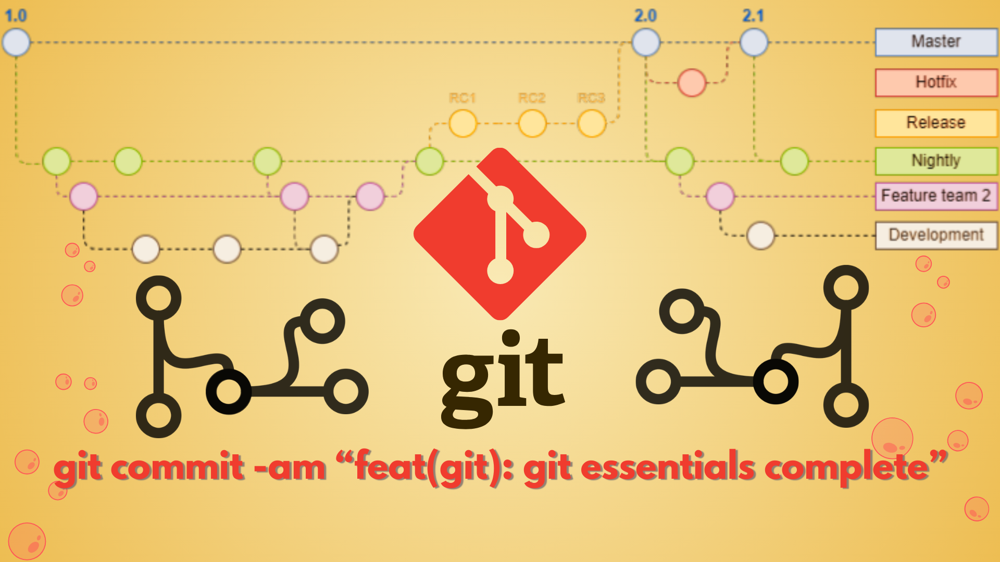

In the ever-evolving landscape of technology, the term "Git" resonates across all domains, playing a pivotal role in the daily workflow of professionals ranging from junior developers to seasoned leads. Git is a powerful tool that can transform the way you work with code and seamlessly collaborate with peers and colleagues working on the same piece. It helps track changes to source code during software development, making it easier to manage, share, and collaborate on projects.

To facilitate a hands-on understanding of Git through practical application for readers at different proficiency levels, I have segregated the topic into three proficiency categories. Let's start with the Git essentials and nomenclature required for beginners and smartly leverage ourselves to seasonal lead. For practical implementation and practice of the Git concepts, a shell script is included to bootstrap local, remote, and clone repositories.

## Flow

1. [Read on Medium?](https://godwin1100.medium.com/git-mastering-the-essentials-06f06ee7ad72)
2. [What is Git?](#what-is-git)
3. [Nomenclature](#nomenclature)
4. [Workflow](#workflow)
5. [Git Installation](#git-installation)
6. [Configuring Git](#configuring-git)
7. [Initialize a Git repository](#initialize-a-git-repository)
8. [Staging the Resources](#staging-the-resources)
9. [Status of Repository](#status-of-repository)
10. [Committing the Changes](#committing-the-changes)
11. [Create a Branch](#create-a-branch)
12. [Merging Branch](#merging-branch)
13. [Remote Repository](#remote-repository)
14. [Pushing to Remote](#pushing-to-remote)
15. [Pulling from Remote](#pulling-from-remote)
16. [Branch Tracking](#branch-tracking)
17. [Cloning the Repository](#cloning-the-repository)
18. [Diving into the Basics](#diving-into-the-basics)
    1. [`git config`](#git-config)
    2. [`git commit`](#git-commit)
    3. [`git log`](#git-log)
    4. [`git branch`](#git-branch)
    5. [`git remote`](#git-remote)
    6. [`git merge`](#git-merge)
    7. [`git push`](#git-push)
    8. [`git rm`](#git-rm)
    9. [`git checkout`](#git-checkout)
19. [Bonus](#bonus)
20. [Reach Out](#reach-out)

## What is Git?

Git is a free and open-source distributed Version Control System (VCS) that is an integral part of the software development life cycle, and it is prevalent to workforces of all sizes, whether it's a small-scale start-up or a big tech giant. Version control systems refer to software tools that assist teams in tracking and managing changes to source code over time. Git excels in tracking changes to source code, streamlining project management, non-linear development, and enhancing the overall efficiency of collaborative efforts. One can interact with Git using the CLI and GUI locally. Popular platforms like [GitHub](https://github.com/), [GitLab](https://about.gitlab.com/), and [Bitbucket](https://bitbucket.org/product/) provide hosting services for Git repositories, making it easier for teams to collaborate, share code, and manage their codebase.

## Nomenclature

Let's understand basic nomenclature around the Git space to get familiar with its terms and usage.

- **local repository:** A directory named `.git` that contains all of your necessary repository files; a Git repository skeleton. The local repository has exactly the same features and functionality as any other Git repository.

- **commit:** Commit is a snapshot of changes made to the files in a repository. It represents a specific version in the repository's history.

- **branch:** It is a separate or new line of development that allows one to work on the code base without affecting the main codebase(default branch) until it's merged with the default branch. The default branch name generally is **main** (previously **master**).

- **blob:** A blob in Git is a binary large object that represents the content of a file without any metadata. It stores the file's data in its raw form.

- **tree:** A tree represents a snapshot of the project's directory structure at a specific commit. It stores references to blobs(file contents) and other trees (subdirectories). The Git working tree consists of all the files and directories we add to the Git repository that are located outside of the `.git` folder.

- **working directory/workspace/checkout:** Local checkout of your code. It's any directory on your filesystem that has a repository associated with it (has `.git` sub-directory folder). It includes all the files and sub-directories in that directory.

- **untracked:** "Untracked" refers to files that are not currently monitored/tracked by the VCS. It needs to be explicitly added to the staging area to track.

- **tracked:** "Tracked" refers to files being tracked and managed by the VCS. It is an asset that Git knows about and keeps track of it.

- **staged/index/cache/staging area:** The staging area in Git is a temporary storage area, where changes are placed before committing them to the repository. It holds a snapshot of the changes that are set to be included in the next commit.

- **committed:** "Committed" refers to the state where changes have been successfully saved to the version control system. The changes are now part of the repository's history.

- **modified:** Git sees the tracked file as "modified"; it indicates that changes have been made but not yet committed since the workspace's last commit.

- **ignore:** Exclude files or directories from being tracked by version control. Generally done by creating a `.gitignore` file and listing the patterns of files and folders to be ignored.

- **remote repository:** A repository that is hosted on a server or another location, separate from the local repository on your machine.

- **origin (remote name):** "origin" is a default alias often used to refer to the main remote repository from which a local repository was cloned.

- **upstream (remote name):** When you fork a repository, the original repository is often referred to as the "upstream" repository.

- **upstream branch:** The term "upstream branch" generally refers to the branch in the remote repository that a local branch is tracking.

- **.gitignore:** `.gitignore` is a configuration file in Git that specifies files and directories to be ignored by version control.

## Workflow

### Git Workflow

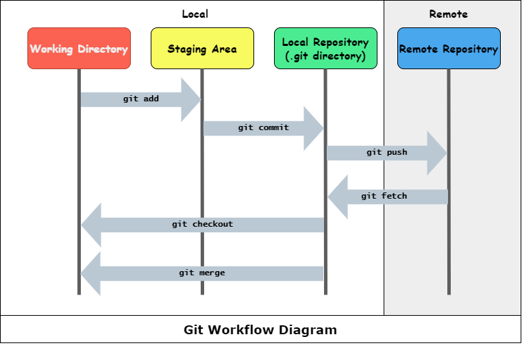

1. **Working Directory:** Make changes to files in the working directory.
2. **Staging Area:** Add changes to the staging area to prepare them for the next commit.
3. **Local Repository:** Commit the staged changes to the local repository, creating a snapshot of the project's state.
4. **Remote Repository:** Push committed changes from the local repository to the remote repository for collaboration and version control.

### Lifecycle of file status

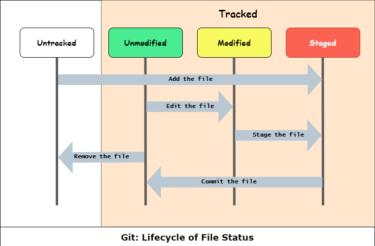

1. **Untracked:** File is not yet tracked by Git.
2. **Unmodified:** File is tracked, and there are no changes since the last commit.
3. **Modified:** Changes have been made to the file since the last commit.
4. **Staged:** Modified changes are marked to be included in the next commit.

## Git Installation

Git is available for all operating systems, including Linux, Windows, and MacOS. One can follow the installation guide [Installing Git](https://git-scm.com/book/en/v2/Getting-Started-Installing-Git) or download directly from [Git Downloads](https://git-scm.com/downloads) based on the OS.

After successful installation, check whether the Git executable is set up correctly and accessible. We can run a git command from CLI to check its version and verify it. Execute the following command

```bash
git --version
```

## Configuring Git

Now we can start configuring Git with basic configuration, let's register the user's name and email, and set the default branch name explicitly. It's not an obligation to set a username and email when working locally, but it's a must when collaborating with others on cloud platforms. Let's set the user's name and email at a global level which will provide your identity

```bash
git config --global user.name "John Doe"
git config --global user.email "johndoe@example.com"
```

The default branch name in Git is `master`. The current standard naming convention followed by the remote repository for the default branch is `main`, we can configure this locally by

```bash
git config --global init.defaultbranch main
```

- `--global` flag ensures that configurations are applied at a global level and not at the local repository level

## Initialize a Git repository

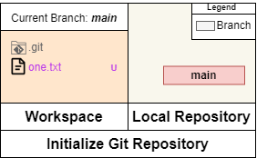

We can get a Git repository on our local machine in two ways: by cloning the existing repository (more about that in the later section) and by initializing a fresh repository for an incredible project. Let's see how to initialize a fresh Git repository.

```bash
git init
```

This will initialize a local git repository (`.git` hidden folder) in the current directory.

What if we want to create a git repository with an initial branch different from the configured initial branch?

```bash
git init -b <name>
# or
git init --initial-branch <name>
```

## Staging the Resources

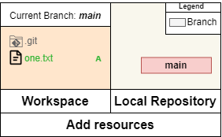

After setting up our local repository, let's create resources and add them to the repository to start tracking.

```bash
git add /path/of/dir-or-file
# add all files and folder of current dir
git add .
# add particular files
git add ./file1 ./folder/file1 ./file2
```

The `git add` command will add the untracked and modified files and folders to the staging area.

## Status of Repository

With so many changes going on with files and directories within the repository, it becomes hard to remember which file is staged, deleted, or modified.  
For the same reason, Git provides a `git status` command that shows the status of every resource that is tracked, modified, deleted, added, renamed, or untracked.

```bash
git status
```

## Committing the Changes

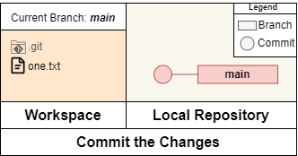

It's time to commit all the stage resources to our repository.

```bash
git commit
```

Each commit requires a message that is associated with it; thus, executing the above command will open the configured editor to provide the message. The message ought to be a short one-liner that clarifies the modifications in the commit.

For a faster commit, we can use the `-m` flag to add the message during the commit process.

```bash
git commit -m <message>
# or
git commit --message <message>
```

Modified tracked files need to be staged, and we can stage them with `git add`. `git commit` also provides the `-a` flag to add all the modified tracked files to the staging area.

```bash
git commit add .
git commit -m <message>
# ------------------------------------------------------------ #
git commit -am <message> # add modified files to staging area
# or
git commit --all -m <message>
```

> Untracked files are to be added explicitly by `git add` to be tracked and staged.

## Create a Branch

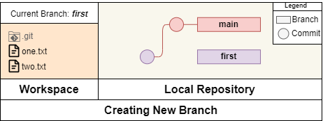

Need to multitask on the same project and task are poles apart? No worries, create a new branch and start working on another task simultaneously just be sure to commit the changes before switching the branch.

```bash
git branch <branch_name> # create new branch
git checkout <branch_name> # switch to branch
# ------------------------------------------------------------ #
git checkout -b <branch_name> # create a new branch and switch
```

To switch to any branch, we can execute `git checkout <branch_name>` more on this in the later section of the blog.

## Merging Branch

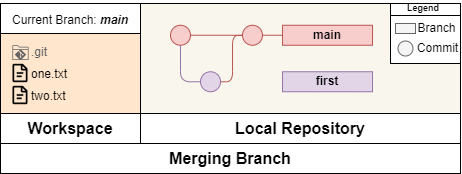

Once multitasking is complete, it's time to consolidate all the branches into a branch. Merging a branch is simple with the `git merge` command. Ensure that your active current branch is the desired branch where you want to merge (the destination branch).

```bash
git checkout <destination_branch> # ensure you are on destination branch
git merge <branch_name> # source branch to merge with destination branch
```

> If there's a conflict during the merge, Git will prompt to manually resolve the conflict, stage the changes, and continue with the merge.

## Remote Repository

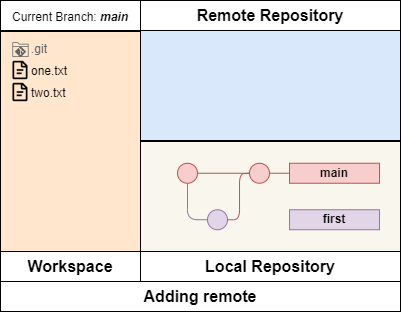

It's time to push our repository to the remote server so others can collaborate. The remote server can be any other Git repository locally or cloud services like GitHub, GitLab, BitBucket, etc. First, we need to add a remote repository server to our local git repo

```bash
git remote add <remote_name> <remote_url>
```

A single repository can link to more than one remote repository. We require only two remote repositories to track based on the use case.  
One will be named `origin`, indicating the repository from which you cloned your local repository. It's the default remote repository where you push changes or pull updates.

```bash
git remote add origin <remote_url_local_clone>
```

Another will be named `upstream`, which you set up manually to track the original repository in the context of forks or copies. The `upstream` remote is necessary when contributing to other repositories to keep the local repository in sync with the original repository.

```bash
git remote add upstream <remote_url_original_repo_of_fork>
```

## Pushing to Remote

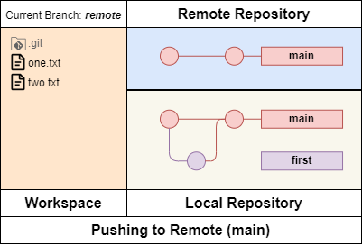

It's time to push the branch from the local to the remote repository. It is sweet and simple to push just like

```bash
git push <remote_name> <branch_name>
```

The remote repository will reject the push if you are not authorized and the local repository is not in sync with the remote. We need to pull the updates from the remote to the local repository to sync, and then we can push our changes.

## Pulling from Remote

The `git pull` command pulls the updates from the remote repository locally similar to `git push`

```bash
git pull <remote_name> <branch_name>
```

This will pull the changes from the remote repository locally, and if any conflict arises, it will require a manual resolution.

## Branch Tracking

Branch tracking refers to the association between a local and a remote branch. Git can set up tracking so the local branch knows which remote branch it corresponds to. This tracking information helps Git users manage changes, push updates, and pull changes efficiently.

For a new branch created locally or an existing branch without an upstream branch, we can set the tracking branch while pushing it to remote with the `-u` or `--set-upstream` flag, which will associate the remote branch with the local branch with the same name.

```bash
git push -u <remote_name> <local_branch_name>
# or
git push --set-upstream <remote_name> <local_branch_name>
```

For existing branches without upstream, we can set the upstream with

```bash
git branch -u <upstream_branch>
# or
git branch --set-upstream-to=<remote_name>/<upstream_branch>
```

This allows us to run the `git push` and `git pull` commands without specifying the remote and branch names.

```bash
git push # will push from the upstream branch
git pull # will pull from the upstream branch
```

## Cloning the Repository

We can clone the existing repository from the remote or local repository that will clone(download) every branch, commit, and tag to the desired directory with remote **(_origin_)** and branch tracking configured according to the source repository.

```bash
git clone <repo_uri_repo_path> [<dir>] # will create dir with remote repo name
# ---------------------------- #
git clone <repo_uri> # to clone remote repository
# ---------------------------- #
git clone <repo_path> # to clone local repository
```

This will create a directory with the name of the remote repository that contains the Git repository. The repo_uri/repo_path will be the remote repository (origin), and cloned branches will have an upstream branch to track.

## Diving into the Basics

Now that we are familiar with the required basic commands, it's time to dive deep into those commands to learn how to use them more efficiently.

To check available flags and commands of Git, one can append `-h` that shows inline help in `stdout` or `--help` that opens webpage help.

To exit the pager output in the Git output one can press `q` key.

### `git config`

Git searches for configuration settings first at the local repository level, giving them priority over global settings. By default, when using `git config`, configurations are applied specifically to the local repository. If you want to apply configurations globally, you need to set the `--global` flag.

To list all the configuration

```bash
git config --list # list both local and global config
git config --local --list # list local config
git config --global --list # list global config
```

To check specific configuration's value

```bash
git config --get <config_key> # return the value of config_key
git config <config_key> # return the value of config_key
# ------------------ #
git config user.name # return user.name
```

To change the default editor

```bash
git config --global core.editor <executable_path_name> # set globally
```

> Configuration for setting `core.editor`: https://git-scm.com/book/en/v2/Appendix-C%3A-Git-Commands-Setup-and-Config

### `git commit`

Updating the last commit message, useful to correct any typo mistake

```bash
git commit --amend # will open default editor to edit the message
# or
git commit --amend -m <message> # update old message with <message>
```

### `git log`

The `git log` command shows logs for the current branch with the following details in the following format

```
commit <commit_hash>
Author: <author_name> <author_email>
Date: <date>

  <commit_message>

```

> To exit paginated `git log` view, one needs to press `q` key.

To view logs of other branches we can use

```bash
git log <branch_name>
```

Want to check only the last $n$ logs?

```bash
git log -n <n>
# or
git log -$
# ---------- #
git log -n 5 # show last 5 logs
# or
git log -5 # show last 5 logs
```

Only interested in the commit message and commit hash of logs? No problem you can try

```bash
git log --oneline
```

that shows logs in the following format

```
abbreviated_commit_hash <commit_message>
```

### `git branch`

To list all branches in the git repository

```bash
# list local branches
git branch
# or
git branch -l
# or
git branch --list
# ----------- #
# list local and remote branch
git branch -a
# or
git branch --all
```

To view the branch and its upstream tracking branch

```bash
git branch --v
# <branch_name> <abbr_commit_hash> [<upstream_branch>] <latest_commit_message>
```

There will be a marker (\*) in front of the current branch while listing all the branches or to check the current branch name, one can execute

```bash
git branch --show-current
```

To delete the local branch from the git repository

```bash
git branch -d <branch_name> # delete fully merged branch with current branch
# or
git branch --delete <branch_name> # delete fully merged branch with current branch
```

To delete a branch even if not merged

```bash
git branch -D <branch_name>
```

### `git remote`

List all git remotes

```bash
git remote
# ----------- #
git remote -v # shows URl for fetch and push
```

See details for specific remote

```bash
git remote show <remote_name>
```

To remove remote

```bash
git remote remove <remote_name>
# or
git remote rm <remote_name>
```

### `git merge`

During the merge, one can encounter conflict, which you need to resolve manually and then continue with the merge. Let's look at some options that we have during the conflict.

To confirm the resolution of the merge conflict, one needs to resolve the conflict, add the files to the stage, and perform a commit or continue with the merge.

```bash
# after resolving the conflict in the file
git add <file>
git commit -m <message>
# or
git commit -am <message>
# --------------------- #
git add <file>
git merge --continue # will commit and open editor to write message
```

> `git commit` and `git merge --continue` are basically doing the same, but `git merge --continue` presents a consistent UI with other Git commands.

To abort the merge process completely and undo everything to state before the merge.

```bash
git merge --abort
```

To exit the merge process without completing the merge, leaving your working directory and index in a partially merge state.

```bash
git merge --quit
```

### `git push`

The `git push` command is used to push changes and updates to the remote repository. To push all branches at once

```bash
git push --all <repository> [<branch_name>]
# or
git push --branches <repository> [<branch_name>]
```

To delete a branch from the remote repository

```bash
git push -d <repository> <branch_name>
# or
git push --delete <repository> <branch_name>
```

### `git rm`

The `git rm` command can remove files from the working tree and the index. It is primarily used to remove tracked files from the index.

```bash
git rm <file_path> # remove from index and working tree
```

To remove files from cached/index. Beware that the file will not be tracked and will not be available if the index is changed, as git keeps the state in sync. To avoid a such scenario, add files in `.gitignore` from the get-go.

```bash
git rm --cached <file_path> # keeps in tree and remove from index
```

To remove the directory one needs to use `-r` flag

```bash
git rm -r <dir_path> # removes files and folder recursively
```

Git won't allow you to remove files and directories in case it's modified or exist in Git but not in the working tree, to remove such files and directories

```bash
git rm -f <file_path>
# or
git rm --force <file_path>
```

### `git checkout`

To switch the current branch one can do

```bash
git checkout <branch_name>
```

To traverse to the previous commit state

```bash
git checkout <commit_sha>
```

To discard all the changes of modified files/directories

```bash
git checkout -- <file_dir_path>
# ------------------------- #
git checkout -- . # will discard all the changes from current dir and sub dir
```

## Bonus

### `.gitignore`

`.gitignore` is a file used by Git to determine which files and directories to ignore when tracking changes in a Git repository. You need to specify certain files or patterns of files that you don't want Git to consider as part of your VCS. Following are the patterns:

```ini
# Line beginning with # are treated as comment
filename.txt # - Ignore Specific Files:
dirname/ # - Ignore Specific Directories:
*.log # ignore all .log files # - Ignore Patterns:
# - Negation: order matters for negation
*.txt # ignore all .txt file
!important.txt # to negate the pattern one can prefix ! to the pattern. !important.txt will be tracked
```

To get language or project-specific `.gitignore`, one can get the file template from https://github.com/github/gitignore

### Practical Implementation

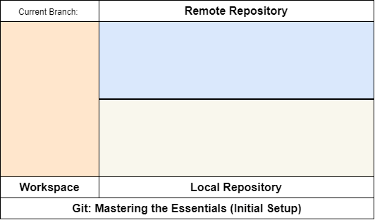

For practical implementation, you can download the shell script from [GitHub](./Git_Mastering-the-Essentials.sh) and execute it locally, the script will create a local repository, a remote repository locally, and a cloned repository that will simulate practical Git implementation as shown above.  
To execute the shell script `sh ./Git_Mastering-the-Essentials.sh`, you get `sh.exe` installed with Git Installation.

### Message Convention

Using a consistent commit message convention offers several benefits like clarity and readability, semantic versioning, facilitates collaboration, code maintenance and refactoring, or automated tools integration.

A popular convention is the "Conventional Commits" convention, which defines a standard format for commit messages. According to Conventional Commits, a commit message should have the following structure:

```
<type>[scope]: <description>

[optional body]

[optional footer(s)]
```

- **Type:** Describes the type of change being made. Common types include:
  - **_feat:_** A new feature
  - **_fix:_** A bug fix
  - **_docs:_** Changes in documentation
  - **_style:_** Changes that do not affect the meaning of the code (eg. formatting, whitespaces, semicolons)
  - **_refactor:_** Code changes that neither fix a bug nor add a feature
  - **_test:_** Adding missing tests or correcting existing tests
  - **_chore:_** Changes to the build process or auxiliary tools
  - **_perf:_** Changes that improve the performance
- **Scope:** (Optional) Describes the part of the code affected within the scope of the commit (e.g., module, file, component).
- **Description:** A brief description of the changes being made or the subject of the commit.
- **Body:** (Optional) Must start one blank line after the description. Provides a more detailed description of the changes. This can include contextual information for the change, any breaking changes, etc. For breaking changes, the Body must start with "BREAKING CHANGE".
- **Footer(s):** (Optional) Additional metadata about the commit, such as references to issues or pull requests.

Example

```bash
git commit -a # edit the message in editor
# or
git commit -am "feat(blog): Git: Mastering the Essentials added" -m "- Table of content added
- Included Workflow image asset
- Info added regarding basic workflow
- Added deep dive for commands" -m "Closes #123"
```

```
# git log output:
feat(blog): Git: Mastering the Essentials added

- Table of content added
- Included Workflow image asset
- Info added regarding basic workflow
- Added deep dive for commands

Closes #123
```

## Reach Out

For more intuitive blogs follow me on Medium & Github. You can also reach out to me via LinkedIn or X(Twitter).

[][reach_linkedin]
[][reach_x]
[][reach_github]
[][reach_medium]

[reach_linkedin]: https://www.linkedin.com/in/godwin1100
[reach_x]: https://twitter.com/l_shivam_l
[reach_medium]: https://medium.com/@godwin1100
[reach_github]: https://github.com/GodWin1100
