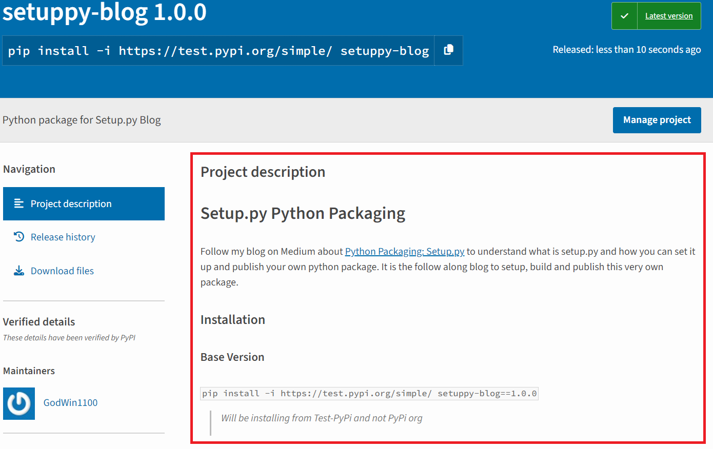

# Python Packaging: Setup.py


Packaging Python projects efficiently is a crucial skill for any developer, whether for open-source or internal packages or personal projects. Packaging ensures that applications are easily distributable and maintainable. One of the fundamental tools in this process is `setup.py`, a script used in Python to manage the distribution of software packages.

In this blog, we'll delve into the essentials of `setup.py`, exploring its role in the Python ecosystem, how it simplifies the packaging process, and best practices for creating your setup scripts. To make the learning experience practical and engaging, we'll walk through a hands-on project that demonstrates real-world applications of `setup.py` features, including `console_scripts` for creating command-line tools, `extra_requires` for optional dependencies, and how to bundle asset files and last but not least we will publish the package to the Python Package Index (PyPI).

Whether you're a novice aiming to understand the basics or an experienced coder looking to refine your packaging techniques, this guide will equip you with the knowledge to streamline your Python projects effectively.

You can access the completed code on [GitHub](https://github.com/GodWin1100/Blogs/tree/main/04-Python-Packaging_Setup.py/setuppy_blog) and follow along. View the publish package at: https://test.pypi.org/project/setuppy-blog/

## Flow

1. [Read on Medium?](https://godwin1100.medium.com/python-packaging-setup-py-ae04b3d41653)
2. [What is Python Packaging?](#what-is-python-packaging)
3. [What is `Setup.py`?](#what-is-setuppy)
   1. [Deprecation](#deprecation)
4. [Folder Structure](#folder-structure)
   1. [`__init__.py`](#__init__py)
   2. [`__main__.py`](#__main__py)
   3. [`__about__.py`](#__about__py)
5. [`Setup.py` Keywords](#setuppy-keywords)
   1. [Basic keywords](#basic-keywords)
   2. [Detailed Description keywords](#detailed-description-keywords)
   3. [CLI keywords](#cli-keywords)
   4. [Extra packages keywords](#extra-packages-keywords)
   5. [Classifiers keywords](#classifiers-keywords)
   6. [Package Data keywords](#package-data-keywords)
6. [Building with `build`](#building-with-build)
7. [Publishing with `twine`](#publishing-with-twine)
   1. [Command to Publish](#command-to-publish)
   2. [Upload to Python Repository](#upload-to-python-repository)
   3. [`keyring` support](#keyring-support)
8. [Bonus](#bonus)
9. [Reach Out](#reach-out)

## What is Python Packaging?

Python packaging refers to the process of bundling Python code into a format that can be easily distributed and installed by others. This involves creating a distributable format such as a source distribution (sdist/tar file) or a built distribution (wheel), which can be uploaded to package indexes like PyPI (Python Package Index) and installed using tools like pip.

## What is `Setup.py`?

The `setup.py` file plays a central role in this process. It is a Python script traditionally used to configure the various aspects of a Python package. This file includes metadata about the package (such as name, version, author, and license) and instructions installing it and its dependencies.

> Over time, tools like `setuptools` and `wheel` have become the standard for packaging, and `pyproject.toml` is becoming more prevalent for configuration, but `setup.py` remains widely used and supported.

### Deprecation

The use of `setup.py` as a command line tool is deprecated and not as a build backend. `Setup.py` is a valid configuration file for Setuptools that happens to be written in Python, instead of in TOML (`pyproject.toml`).

You can read more about that on its official site: [Is `setup.py` deprecated?](https://packaging.python.org/en/latest/discussions/setup-py-deprecated/)

## Folder Structure

We will be following `src`-layout structure for developing and building the package. The tree structure of our package will be as follows

```
root # Root/Base path
│   LICENSE
│   pyproject.toml # for build isolation
│   README.md
│   requirements.txt
│   setup.py # setup.py/setup.cfg/pyproject.toml
│
├───src
│   └───setuppy_blog # package name
│       │   __about__.py
│       │   __init__.py
│       │   __main__.py
│       │
│       ├───cli # All CLI functionalities related code
│       │       say.py
│       │       __init__.py
│       │
│       ├───func
│       │       basic_math.py
│       │       say.py
│       │       __init__.py
│       │
│       ├───templates # Static Asset required by the package
│       │       follow.json
│       │       note.txt
│       │
│       └───utils
│               __init__.py
│
└───tests # Contains the test related to the package
        test_basic_math.py
        __init__.py
```

In Python, three special files play crucial roles within a package: `__init__.py`, `__main__.py`, and `__about__.py`. Together, these files contribute to the effective structuring, execution, and documentation of Python packages, enhancing their functionality and usability.

### `__init__.py`

The `__init__.py` file is used to indicate that the directory is a Python package, allowing its modules to be imported. This file can also contain initialization code that runs when the package is first imported, setting up any necessary package-wide configurations or variables. Directories not containing `__init__.py` are normal directories.

### `__main__.py`

The `__main__.py` file enables a package to be executed as a standalone script. When the package is invoked using the command `python -m package_name`, the interpreter executes the code within `__main__.py`. This makes it the entry point for the package’s runtime operations, providing a way to run the package directly from the command line.

### `__about__.py`

Lastly, the `__about__.py` file is typically employed to store metadata about the package, such as its version, author, and license information. Unlike the other two, `__about__.py` is primarily used for descriptive purposes, providing essential information about the package without affecting its functionality. Together, these files help structure, execute, and describe Python packages effectively.

## `Setup.py` Keywords

### Basic keywords

- **`name`:** The name of the package, used for distribution and installation (e.g., `setuppy_blog`).
- **`version`:** The version number of the package, following semantic versioning (e.g., `1.0.0`).
- **`description`:** A summary of what the package does (e.g., `Python package for Setup.py Blog`).
- **`author`:** The name of the package author (e.g., `Shivam Panchal`).
- **`author_email`:** The email address of the package author (e.g., `shivamjpanchal1@gmail.com`).
- **`url`:** specifies the homepage URL for the package, typically a link to the project’s main website, documentation, or repository.
- **`license`:** The license under which the package is distributed (e.g., `MIT`).
- **`package_dir`:** A dictionary mapping package names to directories on the filesystem (e.g., `{'': 'src'}`), the keys are package names and the values are the directories where these packages are located..
- **`packages`:** A list of all Python import packages that should be included in the distribution (e.g., `['setuppy_blog', 'setuppy_blog.cli', 'setuppy_blog.func', 'setuppy_blog.utils']`).
- **`find_packages`:** A function to automatically discover all packages and sub-packages which includes `__init__.py` (e.g., `find_packages(where='src')`).
- **`python_requires`:** The Python version compatibility requirement (e.g., `>=3.10`).
- **`install_requires`:** A list of dependencies required for the package to work (e.g., `['click', 'cowsay']`).

```py
from setuptools import find_packages, setup


about = {}
with open(
    os.path.join(repo_path, "src", "setuppy_blog", "__about__.py"), "r", "utf-8"
) as f:
    exec(f.read(), about)


setup(
    name=about["__title__"],  # name of the package
    version=about["__version__"],  # version of the package
    description=about["__description__"],  # description of the package
    author=about["__author__"], # author of the package
    author_email=about["__author_email__"], # email id of the author
    url=about["__url__"], # homepage URL for the package, such as the GitHub repository or project documentation
    license=about["__license__"], # license under which package will be distributed
    package_dir={"": "src"}, # directory where packages are located
    packages=find_packages(where="src"), # find all packages and list them
    python_requires=">=3.10", # compatible python version
    install_requires=[ # external packages required for our package to work
        "click==8.1.7",
        "cowsay==6.1",
    ],
)
```

### Detailed Description keywords

The `long_description` and `long_description_content_type` keywords affect how your package's detailed description is presented on the Python Package Index (PyPI) and other package repositories.



- **`long_description`:** This provides a comprehensive description of your package, which will appear on your package's PyPI page. It is typically used to give users more detailed information about what the package does, how to install it, how to use it, etc. This often includes the content from your README file (e.g., `open('README.md').read()`).
- **`long_description_content_type`:** This specifies the format of the long description, informing PyPI how to render it. Common formats include `'text/markdown' `for Markdown and `'text/x-rst'` for reStructuredText. Setting this correctly ensures that your long description is properly rendered on the PyPI website, with correct formatting for headers, links, code blocks, etc.

```py
...
with open("README.md", "r", "utf-8") as f:
    readme = f.read()

setup(
    ...
    long_description=readme, # A detailed description of the package
    long_description_content_type="text/markdown", # The format of the long description
    ...
)
```

### CLI keywords

- **`entry_points`:** Defines a mapping of entry points, which can be used to create command-line scripts or plugins. Each entry in the list maps a command name (e.g., `blog-math`) to a function in your package (e.g., `setuppy_blog.cli:main`). When the package is installed, it generates a script in the Python environment’s **bin** directory, allowing the user to run `blog-math` from the command line, which in turn executes the specified function.
- Two common types are `console_scripts` and `gui_scripts`.
  - **`console_scripts`**: These are command-line interface (CLI) tools.
  - **`gui_scripts`**: These are for graphical user interface (GUI) applications. Similar to `console_scripts`, but intended for applications that should be run with a graphical interface. This will launch a GUI application without running in a terminal window.

```py
...
setup(
    ...
    entry_points={
        "console_scripts": [
            "blog-math = setuppy_blog.cli:main", # will create blog-math.exe, and on invocation will execute setuppy_blog.cli:main function
            "blog-say = setuppy_blog.cli.say:cli", # will create blog-say.exe, and on invocation will execute setuppy_blog.cli.say:cli function
        ]
    },
    ...
)
```

> Instead of executing `python -m setuppy_blog` (invokes `__main__.py` which in turn calls `setuppy_blog.cli.say:cli`) user can now directly invoke `blog-say`, this makes your package more user-friendly and accessible, particularly for command-line tools and applications that require a simple interface for execution.

`entry_points` syntax is as follows: `<name> = <package_or_module>[:<object>[.<attr>[.<nested-attr>]*]]`

- **`<name>`:** The name of the command-line script you want to create.
  - Example: `my-script`
- **`=`:** This separates the script name from the module and function specification.
  - Example: `my-script =`
- **`<package_or_module>`:** The Python package or module where the callable is located.
  - Example: `my_package.my_module`
- **`[:<object>]`:** (Optional) The specific callable (function or class) within the module. If omitted, it defaults to the module itself.
  - Example: `my_package.my_module:my_function`, `setuppy_blog.cli:main`
- **`[.<attr>]`:** (Optional) An attribute of the specified object, used if the callable is an attribute of an object rather than a top-level function or class.
  - Example: `my_package.my_module:MyClass.my_method`
- **`[.<nested-attr>*]`:** (Optional) Further nested attributes, used for more deeply nested callable.
  - Example: `my_package.my_module:MyClass.my_method.sub_method`

### Extra packages keywords

- **`extras_require`:** This allows you to specify optional dependencies for your package, which users can choose to install if they need additional features. This is useful for keeping the core package lightweight while providing the flexibility to include extra functionalities for those who need them. These optional dependencies are defined in a dictionary where the keys are names for the optional features and the values are lists of dependencies required for those features.

```py
...
setup(
    ...
    extras_require={
        "feeds": ["feedparser"], # this group includes packages useful for feeds feature
        "quotes": ["requests"], # this group includes packages useful for quotes feature
        "dev": ["feedparser", "requests", "build", "twine"], # this group includes packages useful for build
        "all": ["feedparser", "requests"], # this group includes all the feature packages except build
    },
    ...
)
```

Users can install these optional dependencies using the `extras` syntax with pip

```bash
pip install setuppy-blog # core package
pip install "setuppy-blog[feeds]" # core package + feeds feature
pip install "setuppy-blog[quotes]" # core package + quotes feature
pip install "setuppy-blog[all]"  # core package + all user feature
pip install "setuppy-blog[dev]"  # all user features + dev features
```

### Classifiers keywords

- **`classifiers`:** It provides metadata about your package, helping users and tools to understand the package's intended audience, environment, license, and other attributes. These classifiers are predefined strings listed in the [Python Package Index (PyPI) classifiers](https://pypi.org/classifiers/). This enhances the package's visibility on PyPI and ensures it reaches the appropriate audience effectively. Classifiers are also used as filters for browsing projects on [PyPI](https://pypi.org/search/).
- Here are some commonly used classifiers that might be appropriate for a wide range of packages:
  - Development Status
  - Intended Audience
  - Programming Language
  - Environment
  - License
  - Topic
  - Framework
  - Operating System


```py
...
setup(
    ...
    classifiers=[
        "Development Status :: 6 - Mature",
        "Intended Audience :: Developers",
        "License :: OSI Approved :: MIT License",
        "Natural Language :: English",
        "Programming Language :: Python :: 3",
        "Programming Language :: Python :: 3.10",
        "Topic :: Software Development :: Build Tools",
        "Topic :: Software Development :: Libraries :: Python Modules",
        "Topic :: Documentation",
        "Environment :: Console",
        "Typing :: Typed",
        "Operating System :: OS Independent",
    ],
    ...
)
```

### Package Data keywords

- **`package_data`:** keyword argument is used to specify additional files that should be included in the package when it is distributed. This is crucial for including non-code files such as templates, static files, configuration files, or any other data files that the package might need to function properly. The value of `package_data` is a dictionary where the keys are package names and the values are lists of patterns matching the files to be included.

```py
...
packages = [*find_packages(where="src"), "setuppy_blog.templates"]
...
setup(
    ...
    packages=packages,
    package_data={"setuppy_blog.templates": ["*.json"]}, # `setuppy_blog.templates` refers to `src/setuppy_blog/templates`
    ...
)
```

Data files are normally added in a directory that does not contain `__init__.py`, we need to add such package's path manually as seen above or we can use `find_namespace_packages` instead of `find_packages`. Even if additional files are added in a Python package directory, i.e. includes `__init__.py`, it will include only `.py` files and not data files or other extension files.

## Building with `build`

Building a Python package involves creating a distributable version of your project, which can be uploaded to package repositories like PyPI (Python Package Index) or installed directly. The `build` tool is a Python package that can be installed with `pip install build`. To build the package, first, get to the root of your directory where your `setup.py`/`pyproject.toml` exists and execute `python -m build`. This package simplifies the build process and it will generate distribution files for your package. These files are placed in the `dist` directory by default. The output typically includes:

- **Source Distribution (sdist):** This is a tarball (e.g., .tar.gz file) containing the source code of your package and can be used to build your package from a source.
- **Built Distribution (wheel):** This is the binary distribution (e.g., .whl file) that is ready for installation. Wheels are preferred for installation because they do not require building or compilation, making the process faster and simpler.

The generated distribution file naming convention will be as follows

```
dist/
    {your_package_name}-{version}-{python_tag}-{abi_tag}-{platform_tag}.whl
    {your_package_name}-{version}.tar.gz
-----
dist/
    setuppy_blog-1.0.0-py3-none-any.whl
    setuppy_blog-1.0.0.tar.gz
```

### Deprecated

With deprecated commands of `setup.py`, distribution files can be generated as follows

```bash
# Create Source Distribution:
python setup.py sdist

# Create Wheel Distribution:
python setup.py bdist_wheel
# requires wheel python package to be installed
```

## Publishing with `twine`

When we execute the command to create our distribution, a new directory `dist/` is created under our project’s root directory that contains your distribution file(s) to be uploaded.

We will use [`twine`](https://twine.readthedocs.io/en/stable/) to upload the distribution files. It requires a **username**, **password**, and the **URL** of the repository (PyPI or TestPyPI). If we want to publish to the official **PyPI**, the URL is typically `https://upload.pypi.org/legacy/`. For **TestPyPI**, it's `https://test.pypi.org/legacy/`.

Install `twine` with `pip install twine`

### Command to Publish

```bash
# will prompt for username and password
twine upload /path/to/distribution/files
twine upload dist/*

# Will take username and password via args
twine upload -u <USERNAME> -p <PASSWORD> /path/to/distribution/files
twine upload -u __token__ -p <TOKEN> dist/*
```

### Upload to Python Repository

```bash
twine upload --repository testpypi dist/* # Upload to Test PyPI Index
twine upload -r testpypi dist/* # Upload to Test PyPI Index

# --repository-url overwrites --repository
twine upload --repository-url https://test.pypi.org/legacy/ dist/* # Upload to given repository URL
```

### `keyring` support

Twine supports storing the username and password securely using [`keyring`](https://pypi.org/project/keyring/). Once Twine is installed, use the `keyring` program to set a **username** and **password** to use for each repository to which you may upload.

For example, to set the username and password for the repository `keyring set <repository_url> <your-username>`, and enter the password when prompted. The next time you run `twine`, it will prompt you for a username, and then get the appropriate password from `keyring`.

In some cases, the presence of Keyring will cause unexpected or undesirable prompts from the backing system or when executing the script via the CI/CD pipeline. In these cases, it may be desirable to disable Keyring altogether. To disable Keyring, run: `keyring --disable`

## Bonus

### Virtual Environment

A virtual environment is an isolated Python environment that allows you to manage dependencies for different projects separately. This ensures that the packages and versions used in one project do not interfere with those in another. It is good to have one virtual environment for every Python-based project, as it will isolate the dependencies of every project from the system and each other.

- To create a virtual environment using the `venv` module: `python -m venv <venv_folder>`. Common names for virtual environment folders are **venv**, **env**, **.venv**, **.env**, and **myenv**. Do not forget to add the virtual environment folder to [`.gitignore`](./../03-Git_Mastering-the-Essentials/03-Git_Mastering-the-Essentials.md#gitignore) the file.
- To activate the virtual environment on Windows: `<venv_folder>\Scripts\activate` and on Linux & macOS: `source <venv_folder>\bin\activate`
- To deactivate the virtual environment on Windows: `deactivate` and on Linux & macOS: `source deactivate`

### Modernize `Setup.py`

To modernize a `setup.py` based project, the project must contain a `pyproject.toml` file at the root of its source tree i.e. at the same level as of `setup.py` and should include `[build-system]` as follows

```toml
[build-system]
requires = ["setuptools"]
build-backend = "setuptools.build_meta"
```

- `[build-system]`: Specifies the build system requirements for the project.
- `requires`: Lists the packages that are required to build the project.
- `build-backend`: This defines the backend tool to use for building the project.

This triggers the build isolation feature that improves the reliability and reproducibility of Python package builds.
**Build isolation** is the feature where the build process is isolated from the user's current environment. This means that the build process does not use the packages installed in the user's environment but instead creates a temporary, clean environment for the build dependencies and reproducibility.

> NOTE: The presence of a `pyproject.toml` file (even if empty) triggers `pip` to change its default behavior to use build isolation.

## Reach Out

For more intuitive blogs follow me on Medium & Github. You can also reach out to me via LinkedIn or X(Twitter).

[][reach_linkedin]
[][reach_x]
[][reach_github]
[][reach_medium]

[reach_linkedin]: https://www.linkedin.com/in/godwin1100
[reach_x]: https://twitter.com/l_shivam_l
[reach_medium]: https://medium.com/@godwin1100
[reach_github]: https://github.com/GodWin1100
