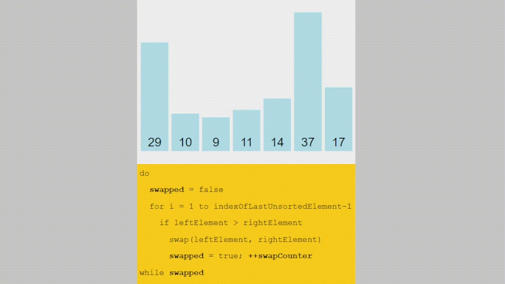
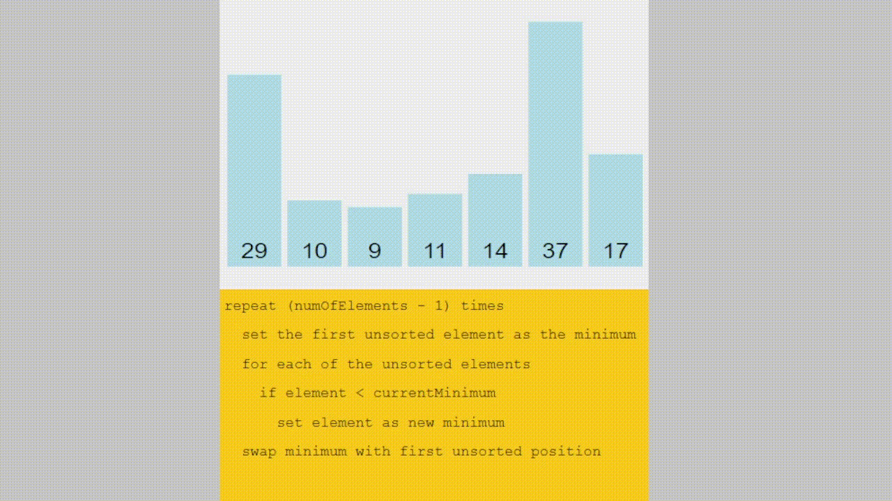
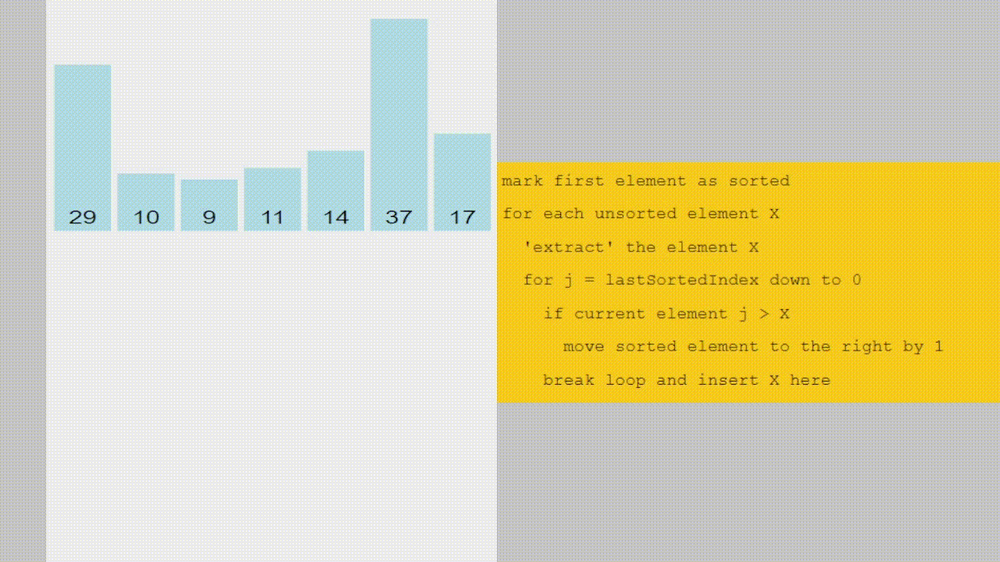
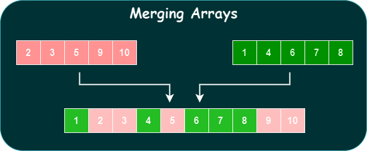
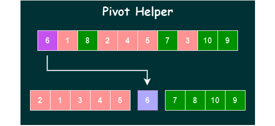
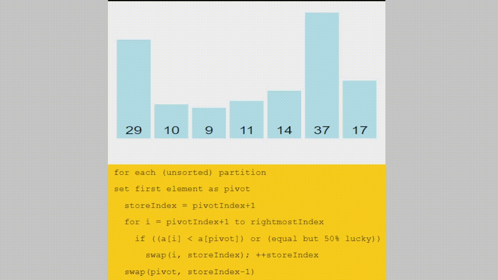
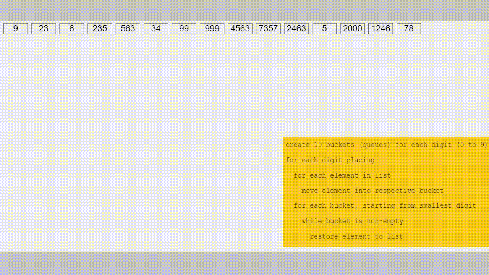
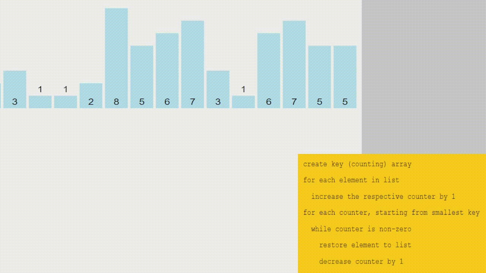
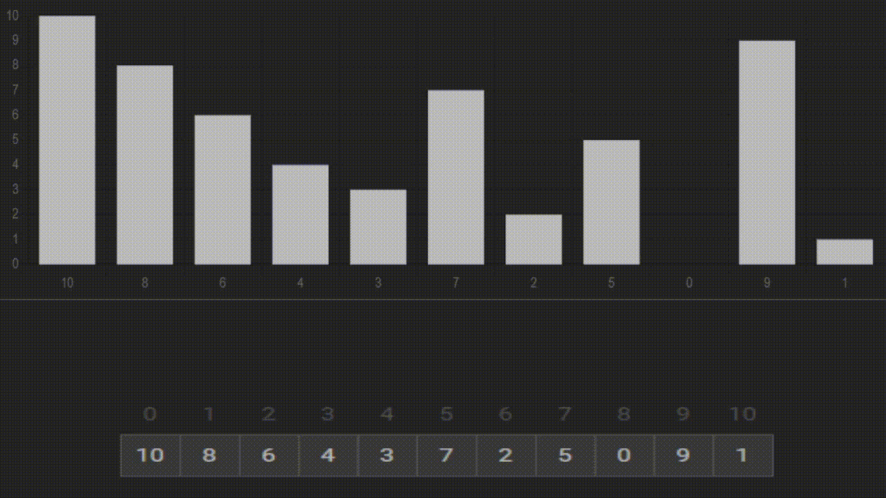
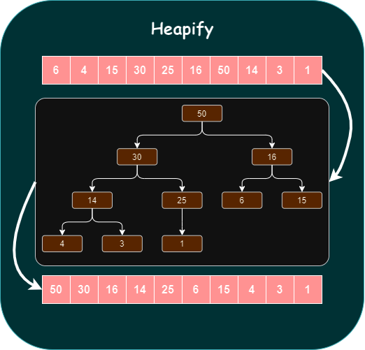

# Kickoff Post

Unlock the Algorithmic Magic: Sorting Techniques Decoded! ✨

🚀 Get ready for a deep dive into the world of Sorting Techniques in Data Structures and algorithms! 📊✨

🔍 Curious about the magic behind sorting algorithms? Stay tuned for my upcoming post where I'll unpack each sorting technique with eye-catching visualizations, unravel their space and time complexities, and provide you with a clear step-by-step algorithmic approach. From Bubble Sort to Heap Sort, we're covering it all! 💡💻

📌 Whether you're a tech enthusiast, a budding coder, or a seasoned developer looking to brush up on fundamentals, this breakdown will be your go-to guide for mastering these essential DSA tools. 🌐📈

Stay tuned for Bubble Sort and further upcoming Sorting algorithms! Let's explore the world of sorting algorithms together! 🚀🔢

#TechArtisan #DataStructures #Algorithms #SortingTechniques #TechExploration #LearningJourney #GodWin1100

# Bubble Sort

- A sorting algorithm where the largest values bubble up to the top
- It is the simplest sorting algorithm that works by repeatedly swapping the adjacent elements if they are in the wrong order.

## Step-by-step Algorithmic Approach

- Initializing Descending iterator

1. Start looping from the end of the array towards the beginning with a variable called $i$
2. Start an inner loop with a variable called $j$ from the beginning until $i-1$
3. If $arr[j]$ is greater than $arr[j+1]$, swap those two values
4. Return the sorted array

- Initializing Ascending iterator

1. Start looping from the beginning of the array towards the end with a variable called $i$
2. Start an inner loop with a variable called $j$ from the beginning until $n-i-1$
3. If $arr[j]$ is greater than $arr[j+1]$, swap those two values
4. Return the sorted array

## Time Complexity

- Best Case: $O(N)$
- Average Case: $O(N^2)$
- Worst Case: $O(N^2)$

## Auxiliary Space

- $O(1)$

The next stop is Selection Sort, which has quadratic time complexity even in the Best Case, so why does such an algorithm exist? Let's find out in the next post.

#TechArtisan #DataStructures #Algorithms #SortingTechniques #TechExploration #LearningJourney #GodWin1100

# Selection Sort

- Similar to bubble sort, but instead of first placing large values into a sorted position, it places small values into a sorted position
- It repeatedly selects the smallest element from the unsorted portion of the list and swaps it with the first element of the unsorted part
- Better than bubble sort if we only want to minimize the number of swaps, which can help to reduce the memory usage

## Step-by-step Algorithmic Approach

1. Store the first element (index) as the smallest value you've seen so far
2. Compare this item to the next item in the array until you find a smaller number
3. If a smaller number is found, designate that smaller number (index) to be the new "minimum" and continue until the end of the array
4. If the "minimum" is not the value (index) you initially began with, swap the two values

## Time Complexity

- Best Case: $O(N^2)$
- Average Case: $O(N^2)$
- Worst Case: $O(N^2)$

## Auxiliary Space

- $O(1)$ as the only extra memory used is for temporary variables while swapping two values in Array.
- The selection sort never makes more than $O(N)$ swaps and can be useful when memory writing is costly.

It's time to insert Insertion Sort in the next post, which keeps track of sorted and unsorted regions in the array to sort.

#TechArtisan #DataStructures #Algorithms #SortingTechniques #TechExploration #LearningJourney #GodWin1100

# Insertion Sort

- Builds up the sort by gradually creating a larger left half which is always sorted
- This works similar to the way you sort playing cards in your hands.

## Step-by-step Algorithmic Approach

1. Start by picking the second element in the array
2. Now compare the second element with the one before it and swap if necessary
3. Continue to the next element and if it is in the incorrect order, iterate through the sorted portion (i.e. the left side) to place the element in the correct place
4. Repeat until the array is sorted

## Time Complexity

- Best Case: $O(N)$
- Average Case: $O(N^2)$
- Worst Case: $O(N^2)$

## Auxiliary Space

- $O(1)$

Stay tuned for the sorting techniques that require some prerequisite helper functions to make the task easier. Which algorithm would be introductory? That's the correct guess, Merge Sort! Let's merge the Merging Array helper function required for Merge Sort in the next post.

#TechArtisan #DataStructures #Algorithms #SortingTechniques #TechExploration #LearningJourney #GodWin1100

# Merging Arrays

- To implement merge sort, it's useful first to implement a function responsible for merging two sorted arrays
- Given two arrays that are sorted, this helper function should create a new array that is also sorted and consists of all of the elements in the two input arrays
- This function should run in $O(n+m)$ time and $O(n+m)$ space and **should not** modify the parameters passed to it

## Step-by-step Algorithmic Approach

1. Create an empty array, take a look at the smallest values in each input array
2. While there are still values we haven't looked at
   1. If the value in the first array is smaller than the value in the second array, push the value in the first array into our results and move on to the next value in the first array
   2. If the value in the first array is larger than the value in the second array, push the value in the second array into our results and move on to the next value in the second array

Be ready to merge this part with Merge Sort next time...

#TechArtisan #DataStructures #Algorithms #SortingTechniques #TechExploration #LearningJourney #GodWin1100

# Merge Sort

- It's the simple technique of Divide and Conquer and has the combination of two things - merging and sorting
- Exploits the fact that arrays of 0 or 1 elements are always sorted
- Works by decomposing an array into smaller arrays of 0 or 1 elements then building up a newly sorted array

## Step-by-step Algorithmic Approach

1. Break up the array into halves until
   1. you have arrays that are empty or have one element or
   2. lower index is greater than or equal to higher index
2. Once you have smaller sorted arrays, merge those arrays with other sorted arrays until you are back at the full length of the array
3. Once the array has been merged back together, return the merged(sorted) array

## Time Complexity

- Best Case: $O(N \log N)$
- Average Case: $O(N \log N)$
- Worst Case: $O(N \log N)$

## Auxiliary Space

- $O(N)$

Merge sort has efficient time complexity and okayish space complexity.Let's learn about Quick Sort and its tradeoffs in other ways of divide and conquer algorithm. But before that, let's take a quick look at Pivot Helper, which helps divide the array into two parts.

#TechArtisan #DataStructures #Algorithms #SortingTechniques #TechExploration #LearningJourney #GodWin1100

# Pivot Helper

- To implement quick sort, it's useful to first implement a function responsible for arranging elements in an array on either side of a pivot
- Given an array, this helper function should designate an element as the pivot
- It should then rearrange elements in the array so that all values less than the pivot are moved to the left of the pivot, and all values greater than the pivot are moved to the right of the pivot
- The order of elements on either side of the pivot doesn't matter
- The helper should do this in place, that is, it should not create a new array
- When complete, the helper should return the index of the pivot

## Picking a pivot

- The runtime of quick sort depends in part on how one selects the pivot
- Ideally, the pivot should be chosen so that it's roughly the median value in the data set you're sorting
- For simplicity, we'll always choose the pivot to be the first element

## Step-by-step Algorithmic Approach

1. It will help to accept three arguments, an array, a start index, and an end index (these can default to 0 and the array length-1 respectively)
2. Grab the pivot from the start of the array
3. Store the current pivot index in a variable (this will keep track of where the pivot should end up)
4. Loop through the array from the start until the end
   1. If the pivot is greater than the current element, increment the pivot index variable and then swap the current element with the element at the pivot index
5. Swap the starting element (i.e. the pivot) with the pivot index
6. Return the pivot index

Let's look forward to implementing Quick Sort with Pivot Helper.

#TechArtisan #DataStructures #Algorithms #SortingTechniques #TechExploration #LearningJourney #GodWin1100

# Quick Sort

- Like merge sort, exploits the fact that arrays of 0 or 1 element are always sorted
- Works by selecting one element (called the **pivot**) and finding the index where the pivot should end up in the sorted array
- Once the pivot is positioned appropriately, quick sort can be applied on either side of the pivot
- It has quadratic time complexity in the worst case with the trade of logarithmic space complexity

## Step-by-step Algorithmic Approach

1. Call the pivot helper on the array
2. When the helper returns to you the updated pivot index, recursively call the pivot helper on the subarray to the left of that index, and the subarray to the right of that index
3. Your base occurs when you consider a subarray with less than 2 elements

## Time Complexity

- Best Case: $O(N \log N)$
- Average Case: $O(N \log N)$
- Worst Case: $O(N^2)$

## Auxiliary Space

- $O(\log N)$

While not widely used, upcoming sorting techniques are intriguing and much more efficient based on their specific use cases. Stay tuned for more!!!

#TechArtisan #DataStructures #Algorithms #SortingTechniques #TechExploration #LearningJourney #GodWin1100

# Radix Sort

- Radix sort is a special sorting algorithm that works on lists of numbers
- It never makes comparisons between elements
- It exploits the fact that information about the size of a number is encoded in the number of digits
- More digits means a bigger number

## Radix Sort Helpers

- To implement radix sort, it's helpful to build a few helper functions first
  - `getDigit(num, position)`: returns the digit in `num` at the given `position` value
  - `digitCount(num)`: returns the number of digits in `num`
  - `mostDigits(nums)`: Given an array of numbers, returns the number of digits in the largest numbers in the list

## Step-by-step Algorithmic Approach

1. Define a function that accepts a list of numbers
2. Figure out how many digits the largest number has
3. Loop from `k = 0` up to this largest number of digits
   1. Create buckets for each digit(0 to 9) (array with 10-sub array)
   2. Place each number in the corresponding bucket based on it's `k`th digit
   3. Replace our existing array with values in our buckets, starting with 0 and going up to 9
   4. return the list at the end

## Time Complexity

- Best Case: $O(Nk)$, where $k=$ no. of digits
- Average Case: $O(Nk)$, where $k=$ no. of digits
- Worst Case: $O(Nk)$, where $k=$ no. of digits

## Auxiliary Space

- $O(N+k)$, where $k=$ no. of digits

Wasn't that an intuitive sort based on basic mathematical properties? Extremely useful to compare large string numbers based on length.
On the next episode, is it counting, or has the sorting algorithm glitched?

#TechArtisan #DataStructures #Algorithms #SortingTechniques #TechExploration #LearningJourney #GodWin1100

# Counting Sort

- Counting sort is a sorting technique that is based on the keys between specific ranges
- It never makes comparisons between elements
- It performs sorting by counting objects having distinct key values like hashing in sorted key order
- Based on the hash of the number count it creates the array accordingly
- Counting sort is not used as a general-purpose sorting algorithm

## Step-by-step Algorithmic Approach

1. Define a function that accepts a list of numbers
2. Define a hash/array with a max limit for the largest number
3. count the occurrence of numbers and update the count in the hash
4. Take the cumulative sum of hash/array to get the starting index position of the number
   1. Or, initialize variable index=0, for placing the element
5. Iterate the original array
   1. find the element in the hash
   2. subtract the count value by 1
   3. position the array at the count value in the resultant array
      1. Or, position at index value, and increase the index by 1

## Time Complexity

- Best Case: $O(N+k)$, where $k=$ range of input
- Average Case: $O(N+k)$, where $k=$ range of input
- Worst Case: $O(N+k)$, where $k=$ range of input

## Auxiliary Space

- $O(N+k)$, where $k=$ range of input

While counting sort may not be efficient for a large range of numbers, it certainly offers the advantage of achieving the desired time and space complexity.

#TechArtisan #DataStructures #Algorithms #SortingTechniques #TechExploration #LearningJourney #GodWin1100

# Modified Cyclic Sort

- Cycle sort is an in-place, unstable sorting algorithm that is particularly useful when sorting arrays containing elements with a small range of values
- Considering the DSA problem case, where given array values or elements are in the range of $1 \> \text{to} \> N$ or $0 \> \text{to} \> N$, modified Cycle Sort can be used.
- All the given array values should be in the range of $1 \> \text{to} \> N$ or $0 \> \text{to} \> N$.
  - If the range is $0 \> \text{to} \> N$ values correct index position of each array element or value will be the same as its value i.e. at 0th index 0 will be there, for the 1st position 1 will be there, and so on.
  - Similarly, for $1 \> \text{to} \> N$ then every array element’s correct position will be the index == value-1 i.e. means at the 0th index value will be 1 similarly at the 1st index position value will be 2, and so on till nth value.
- There's a complete Cycle sort for any value of number which requires the extra step of rotating the array in each iteration, thus has a time complexity of $O(N^2)$.
- This approach aims to reduce the number of write operations to memory, making it efficient when minimizing write operations is a priority.

## Step-by-step Algorithmic Approach

1. Initialize iterator/index counter ($i$) to $0$ and iterate till it's less than the size of the array ($n$)
2. For $0 \> \text{to} \> N$
   1. Check if the element at $i$ is equal to the index $i$, we would be comparing it as `arr[arr[i]]`
   2. Then increment the counter by 1
   3. Else swap the element at the correct position or index value
3. For $1 \> \text{to} \> N$
   1. Check if the element at $i$ is equal to the index $i-1$, we would be comparing it as `arr[arr[i]-1]`
   2. Then increment the counter by 1
   3. Else swap the element at the correct position or index value
4. Return the sorted array

> We are not directly comparing it with the index as it can result in an infinite loop if there are missing or duplicate elements, instead we are comparing it as `arr[arr[i]]` which is equivalent to comparing it with the correct index

## Time Complexity

- Best Case: $O(N)$
- Average Case: $O(N)$
- Worst Case: $O(N)$

## Auxiliary Space

- $O(1)$

Cycle Sort achieves the best space and time complexity among sorting algorithms under specific criteria and is the most used algorithm to find duplicate, missing, or repeating elements in consecutive ranges.
The next one is the last for now, it's Heap Sort, which requires the Heapify method, so let's look into it next.

#TechArtisan #DataStructures #Algorithms #SortingTechniques #TechExploration #LearningJourney #GodWin1100

# Heapify

- To implement heap sort, it's useful to first implement a function responsible for building the max heap.
- Heapify is a method used in Heap Sort to maintain the max heap property.
- It starts from the last non-leaf node and performs the heapify operation.
- It rearranges elements in the array/heap to ensure that the largest element is at the root.

## Step-by-step Algorithmic Approach

1. Consider the provided index as the largest element
2. Check left($2\times \text{idx} + 1$) and right($2\times \text{idx} + 2$) child nodes and update the largest element index
3. If the largest element is updated
   1. Swap the largest index node with the provided index
   2. Recursively heapify the affected subtree

Let's happily use Heapify in Heap Sort next time.

#TechArtisan #DataStructures #Algorithms #SortingTechniques #TechExploration #LearningJourney #GodWin1100

# Heap Sort

- Heap sort is a comparison-based sorting algorithm that operates by organizing elements in a binary heap
- Like selection sort, heapsort divides its input into a sorted and an unsorted region
- It sorts an array by first creating a heap data structure and then repeatedly removing the maximum (for ascending order) element from the heap and placing it at the end of the array.
- Heap sort maintains the unsorted region in a heap data structure to efficiently find the largest element in each step rather than wasting time in linear scan-like selection sort.

## Step-by-step Algorithmic Approach

1. Loop from $n/2-1$ (No. of leaf nodes to exclude) to $0$ in descending order (bottom-up approach of heapify)
   1. Build the max heap from the given array with heapify process
2. Loop for $N$ times on max heap array
   1. Extract the root(largest) element from the heap and move it to the end
   2. Maintain the pointer for the end of the unsorted elements
   3. Apply heapify process on the remaining unsorted portion

## Time Complexity

- Best Case: $O(N \log N)$
- Average Case: $O(N \log N)$
- Worst Case: $O(N \log N)$

## Auxiliary Space

- $O(1)$

Although logarithmic time complexity, this is the slowest of the sorting algorithms but unlike merge and quick sort, it does not require massive recursion or multiple arrays to work. It's slowest because it has different constant factors and requires 2 reads and writes due to swaps.

#TechArtisan #DataStructures #Algorithms #SortingTechniques #TechExploration #LearningJourney #GodWin1100
